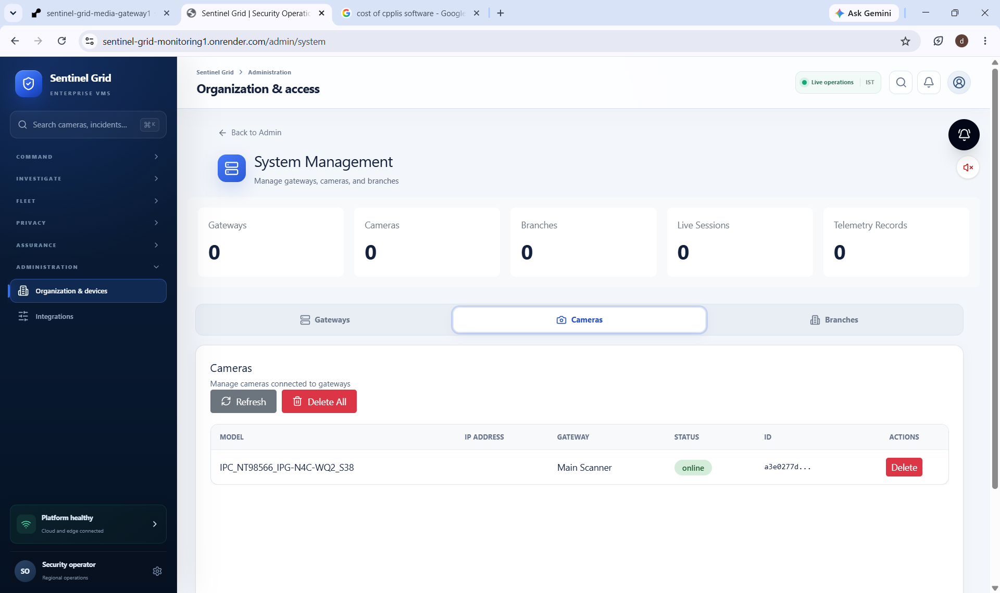

# 🎥 Live View Fix - Action Checklist

## The Problem

Your cameras are on your **local network** (192.168.x.x), but the media gateway on Render is in the **cloud**. The cloud media gateway **cannot reach** your local cameras!

## ✅ Solution: Use Local Edge Agent

The edge agent running on your machine **can** reach your local cameras and has a built-in media gateway.

---

## 📋 Steps to Fix (Do These Now)

### 1️⃣ Ensure Edge Agent is Running

Open a terminal and run:
```bash
cd c:\Omsystems\edge-agent
START_SCANNER_SIMPLE.bat
```

**✅ Verify it shows:**
```
✓ Environment variables loaded from .env
✓ EDGE_AGENT_ID: 6a570d4a-2c71-415f-b59a-643cf50d55c5
Local stream-secret provider listening on 127.0.0.1:8093
Edge agent 6a570d4a-2c71-415f-b59a-643cf50d55c5 registered
```

**Leave this terminal running!**

---

### 2️⃣ Restart Dashboard

The dashboard environment has been updated to use `http://127.0.0.1:8090` (local edge agent) instead of the Render media gateway.

**Stop your dashboard** (Ctrl+C in the dashboard terminal)

Then restart:
```bash
cd c:\Omsystems\dashboard
npm run dev
```

**✅ Verify it shows:**
```
ready - started server on 0.0.0.0:3000, url: http://localhost:3000
```

---

### 3️⃣ Test Live View

1. Open browser: `http://localhost:3000`
2. Navigate to: **Control Room**
3. Click on the camera: **IPC-NT8856G_JPG-N4C-W02-S38**
4. Click the **live view** button

**✅ Expected Result:**
- Video should start playing
- No 502 errors in browser console
- Edge agent terminal shows activity

---

## 🔍 If Still Not Working

### Check 1: Camera is Approved

The camera must be **discovered and approved** first:

1. Go to **Operations → Branches → [Your Branch]**
2. Look for "Discovered Cameras" section
3. If you see the camera there, click **"Approve all & start"**
4. Wait for it to appear in the cameras list

### Check 2: Dashboard Server Logs

Look at the terminal running `npm run dev`. When you click live view, you should see either:

**✅ Success:**
```
(No errors)
```

**❌ If you see errors like:**
```
Live-session startup failed { message: 'Control plane returned 404' }
```
→ Camera is not in the database (needs to be approved first)

```
Live-session startup failed { message: 'media_gateway_unavailable' }
```
→ Edge agent is not running or port 8090 is blocked

### Check 3: Edge Agent Terminal

When you click live view, the edge agent terminal should show:
```
[edge-agent] Creating live session for camera...
[edge-agent] Stream started: /live/session-id
```

### Check 4: Browser Console

Press F12 → Console tab. You should see:
```
POST /api/live 201 (Created)
```

**Not:**
```
POST /api/live 502 (Bad Gateway)
```

---

## 🎬 How It Works Now

```
┌─────────┐      ┌───────────┐      ┌──────────────┐      ┌──────────┐      ┌────────┐
│ Browser │─────→│ Dashboard │─────→│ Control      │─────→│ Edge     │─────→│ Camera │
│         │      │ (Next.js) │      │ Plane        │      │ Agent    │      │ (Local)│
│         │      │ :3000     │      │ (Render)     │      │ :8090    │      │ :554   │
└─────────┘      └───────────┘      └──────────────┘      └──────────┘      └────────┘
    │                   │                    │                    │                │
    │ 1. Click camera   │                    │                    │                │
    ├──────────────────>│                    │                    │                │
    │                   │ 2. Create session  │                    │                │
    │                   ├───────────────────>│                    │                │
    │                   │ 3. Return token    │                    │                │
    │                   │<───────────────────┤                    │                │
    │                   │ 4. Start stream    │                    │                │
    │                   ├────────────────────┴───────────────────>│                │
    │                   │                                          │ 5. Pull RTSP  │
    │                   │                                          ├───────────────>│
    │                   │                    6. Return HLS URL     │                │
    │                   │<─────────────────────────────────────────┤                │
    │ 7. Load video     │                                          │                │
    │<──────────────────┤                                          │                │
```

**Key Points:**
- ✅ Dashboard at `localhost:3000` (your machine)
- ✅ Control Plane on Render (cloud) - creates secure tokens
- ✅ Edge Agent at `localhost:8090` (your machine) - can reach cameras
- ✅ Camera at `192.168.x.x` (your local network)

---

## 📝 Summary

**The fix:** Changed media gateway URL from Render (`https://...onrender.com`) to local edge agent (`http://127.0.0.1:8090`)

**Why:** Render-hosted services cannot reach cameras on your private network (192.168.x.x)

**What's running:**
1. ✅ Edge Agent (local) - Port 8090 - Reaches cameras
2. ✅ Dashboard (local) - Port 3000 - Your UI
3. ✅ Control Plane (Render) - Cloud - Authentication & database

**Action Required:**
1. ✅ Edge agent must be running: `START_SCANNER_SIMPLE.bat`
2. ✅ Dashboard must be restarted: `npm run dev`
3. ✅ Camera must be approved (discovered → approved status)

---

## 🚀 After It Works

Once live view is working locally, if you want to access it from other devices or remotely, you'll need to:

1. **Option A:** Use Cloudflare Tunnel to expose edge agent publicly
2. **Option B:** Deploy edge agent at customer site with public IP
3. **Option C:** Use VPN to access your local network remotely

For now, test it locally first! 🎉
