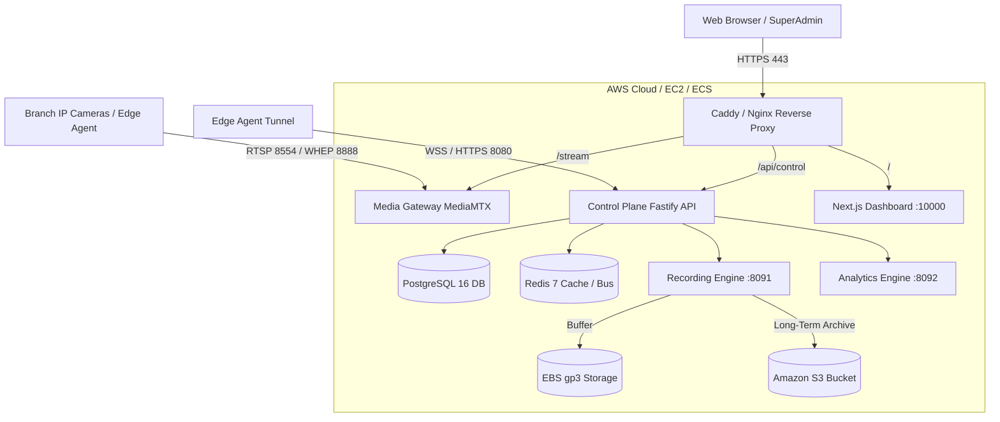

# 🚀 Sentinel Grid (Om Systems) - AWS Production Deployment Guide

This guide provides step-by-step instructions to publish **Sentinel Grid** on **Amazon Web Services (AWS)**.

---

## 🏗️ Architecture Overview



---

## ⚡ Deployment Methods Matrix

| Method | Recommended For | Setup Time | Monthly Cost Estimate | Difficulty |
| :--- | :--- | :--- | :--- | :--- |
| **Method 1: 1-Click AWS CloudFormation (EC2)** | **Production / High Performance** | **5 minutes** | **$35 – $75 / month** | 🟢 Very Easy |
| **Method 2: AWS Lightsail** | **Budget / Quick Pilot** | **5 minutes** | **$10 – $40 / month** | 🟢 Very Easy |
| **Method 3: Enterprise ECS Fargate** | **Large Enterprise / High Scale** | **15 minutes** | **$150+ / month** | 🟡 Intermediate |

---

## 🌟 Method 1: 1-Click AWS CloudFormation Deployment (Recommended)

### Step 1: Open AWS CloudFormation Console
1. Log into your [AWS Management Console](https://console.aws.amazon.com/).
2. Navigate to **CloudFormation** in your desired region (e.g. `ap-south-1` Mumbai, `us-east-1` N. Virginia, or `ap-southeast-1` Singapore).
3. Click **Create stack** -> **With new resources (standard)**.

### Step 2: Upload Template
1. Choose **Upload a template file**.
2. Select [`deploy/aws/cloudformation-ec2-stack.yaml`](file:///c:/Omsystems/Omsystems/deploy/aws/cloudformation-ec2-stack.yaml).
3. Click **Next**.

### Step 3: Configure Parameters
- **Stack name**: `sentinel-grid-prod`
- **InstanceType**: `t3.xlarge` (Recommended: 4 vCPU, 16GB RAM for AI video feeds) or `t3.large`.
- **VolumeSize**: `100` GB (EBS gp3 for Docker images and video cache).
- **DomainName**: *(Optional)* e.g., `cctv.yourcompany.com` (for automated Let's Encrypt SSL).
- **AdminEmail**: `admin@yourcompany.com`

### Step 4: Review and Launch
1. Check the box: `[x] I acknowledge that AWS CloudFormation might create IAM resources`.
2. Click **Submit**.
3. CloudFormation will provision the VPC, Security Groups, IAM Roles, Elastic IP, and EC2 instance in **~3 minutes**.

### Step 5: Access Your Sentinel Grid
Once the stack status reaches `CREATE_COMPLETE`, switch to the **Outputs** tab:
- **Dashboard Direct URL**: `http://<ELASTIC_IP>:10000` (or `https://<YOUR_DOMAIN>`)
- **Control Plane API**: `http://<ELASTIC_IP>:8080/ready`
- **HLS Live Video Stream**: `http://<ELASTIC_IP>:8888`

---

## ⚡ Method 2: AWS Lightsail (Lowest Cost / Quick VPS)

AWS Lightsail gives you a predictable flat monthly bill ($10-$40/mo) with bundled bandwidth.

1. Open [AWS Lightsail Console](https://lightsail.aws.amazon.com/).
2. Click **Create instance**.
3. Select:
   - **Platform**: `Linux/Unix`
   - **Blueprint**: `OS Only` -> `Amazon Linux 2023` (or `Ubuntu 24.04 LTS`).
4. Select instance size:
   - **$20/mo** (4 GB RAM, 2 vCPUs) for up to 10 cameras.
   - **$40/mo** (8 GB RAM, 2 vCPUs) for 20+ cameras & AI analytics.
5. In **Launch script (UserData)**, paste the content of [`deploy/aws/setup-ec2-instance.sh`](file:///c:/Omsystems/Omsystems/deploy/aws/setup-ec2-instance.sh).
6. Click **Create instance**.
7. In the Lightsail instance details under **Networking**:
   - Click **Attach static IP**.
   - Under **IPv4 Firewall**, open custom ports:
     - `TCP 80` (HTTP)
     - `TCP 443` (HTTPS)
     - `TCP 8080` (Control Plane API)
     - `TCP 8554` (RTSP Streaming)
     - `TCP 8888` (HLS Video Streaming)
     - `TCP 10000` (Dashboard UI)

---

## 🏢 Method 3: Enterprise ECS Fargate Deployment

For enterprise high-availability without managing EC2 instances:

1. In AWS CloudFormation, upload [`deploy/aws/cloudformation-ecs-fargate.yaml`](file:///c:/Omsystems/Omsystems/deploy/aws/cloudformation-ecs-fargate.yaml).
2. Enter your RDS master password and optional ACM certificate ARN.
3. The template automatically provisions:
   - **Amazon RDS PostgreSQL 16** with automated daily snapshots.
   - **Amazon ElastiCache Redis** cluster.
   - **Amazon S3** bucket for long-term video retention.
   - **Application Load Balancer (ALB)** with path-based routing.
   - **Amazon ECS Cluster** with Fargate serverless tasks.

---

## 🔒 Security Groups & Ports Reference

| Port | Protocol | Service | Description |
| :--- | :--- | :--- | :--- |
| **80** | TCP | Caddy / Nginx / ALB | HTTP Web & SSL Certificate Challenge |
| **443** | TCP | Caddy / Nginx / ALB | Secure HTTPS Web Dashboard & API |
| **8080** | TCP | Control Plane | Fastify REST API & WebSocket Signaling |
| **10000** | TCP | Dashboard | Next.js Management Web Interface |
| **8090** | TCP | Media Gateway | MediaMTX Management API |
| **8554** | TCP | Media Gateway | RTSP Ingestion & Playback |
| **8888** | TCP | Media Gateway | HLS Video Segments & WebRTC WHEP |
| **8189** | UDP | Media Gateway | WebRTC ICE Media Transport |
| **22** | TCP | OpenSSH | SSH Terminal Access (or use AWS SSM) |

---

## 🌐 Custom Domain & Free SSL Setup

### Option A: Let's Encrypt with Built-In Caddy (Automatic)
1. Point your domain A-record (e.g. `cctv.yourcompany.com`) to the **Elastic IP** in Route 53 or your DNS provider.
2. In `/opt/sentinel-grid/.env`, set:
   ```bash
   DOMAIN_NAME=cctv.yourcompany.com
   ADMIN_EMAIL=admin@yourcompany.com
   ```
3. Restart Caddy:
   ```bash
   docker compose -f deploy/aws/docker-compose.aws.yml restart caddy
   ```
   Caddy will automatically request and install trusted HTTPS certificates.

### Option B: AWS Certificate Manager (ACM) + Route 53
If using AWS Application Load Balancer (ALB):
1. Request a free SSL certificate in [AWS ACM](https://console.aws.amazon.com/acm/).
2. Attach the Certificate ARN to the ALB HTTPS Listener on port 443.

---

## 📹 Amazon S3 Long-Term Video Archiving

To archive recorded footage to Amazon S3:

1. The CloudFormation template creates a private bucket: `sentinel-recordings-<ACCOUNT_ID>-<REGION>`.
2. Videos are saved locally for fast playback on EBS gp3.
3. The sync script [`deploy/aws/s3-recording-sync.sh`](file:///c:/Omsystems/Omsystems/deploy/aws/s3-recording-sync.sh) automatically synchronizes segments to S3 and transitions them to **Glacier Flexible Archive** after 30 days.

To run sync every hour via cron:
```bash
echo "0 * * * * root /opt/sentinel-grid/deploy/aws/s3-recording-sync.sh >> /var/log/s3-sync.log 2>&1" >> /etc/crontab
```

---

## 🛠️ Operations & Maintenance

### Check System Status
```bash
# Check running containers
docker compose -f deploy/aws/docker-compose.aws.yml ps

# View Control Plane logs
docker compose -f deploy/aws/docker-compose.aws.yml logs -f control-plane

# View Live Streaming logs
docker compose -f deploy/aws/docker-compose.aws.yml logs -f media-gateway
```

### Connect via AWS Systems Manager (No SSH Keys Needed)
```bash
aws ssm start-session --target <INSTANCE_ID> --region ap-south-1
```

### Create Instant Database Backup
```bash
docker exec -t sentinel-aws-postgres pg_dump -U sentinel_admin sentinel_grid > sentinel_backup_$(date +%Y%m%d).sql
```
