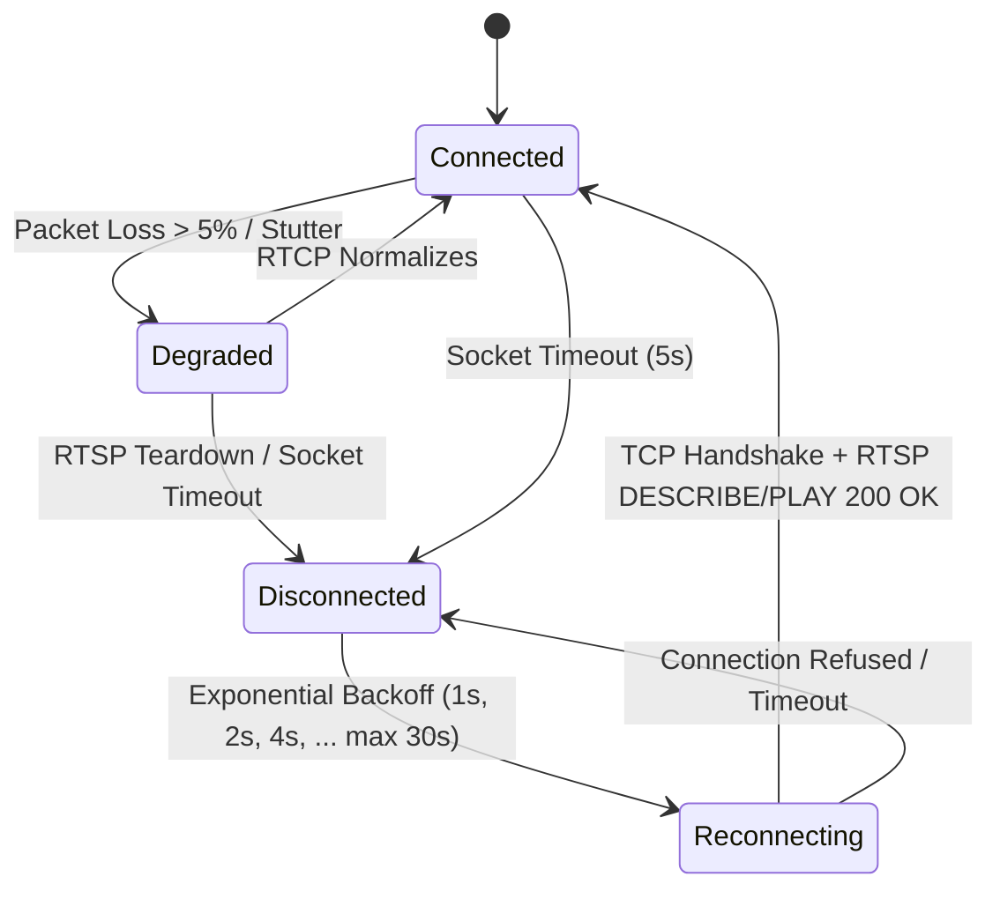

# Sentinel Grid / KryptoVision — Hardware & Device Integration Specification

> **Enterprise CCTV, NVR, DVR & Camera Protocol Integration Standard**  
> **Supported Vendors**: Hikvision, Dahua, CP PLUS, Uniview (UNV), Axis, Hanwha, ONVIF Profile S/G/T  
> **Topology Coverage**: 500+ Branches | 4,000–5,000+ Channels (IP Cameras, Analog Coaxial DVRs, Multi-Channel NVRs)  
> **Status**: Production Authoritative Specification

---

## 1. Device Integration Architecture

Sentinel Grid integrates edge hardware via two primary communication layers:
1. **Control & Telemetry Plane**: REST/ISAPI/CGI/SOAP APIs over HTTP/HTTPS for channel discovery, NTP synchronization, HDD SMART health telemetry, and alarm stream parsing.
2. **Media Bitstream Plane**: RTSP (Real-Time Streaming Protocol) over TCP/UDP, RTP/RTCP for H.264/H.265 video ingestion, WebSockets, and WebRTC streaming.

```
┌─────────────────────────────────────────────────────────────┐
│                      SENTINEL EDGE AGENT                    │
│  ┌──────────────────────────────────────────────────────┐   │
│  │             Hardware Integration Layer               │   │
│  │   ┌──────────────┐ ┌──────────────┐ ┌──────────────┐ │   │
│  │   │  Hikvision   │ │    Dahua     │ │   CP PLUS    │ │   │
│  │   │ ISAPI Driver │ │  RPC Driver  │ │Indigo Driver │ │   │
│  │   └──────┬───────┘ └──────┬───────┘ └──────┬───────┘ │   │
│  │   ┌──────┴───────┐ ┌──────┴───────┐ ┌──────┴───────┐ │   │
│  │   │   Uniview    │ │ ONVIF S/G/T  │ │  RTSP Bridge │ │   │
│  │   │ LAPI Driver  │ │ SOAP Client  │ │ (Analog DVR) │ │   │
│  │   └──────────────┘ └──────────────┘ └──────────────┘ │   │
│  └──────────────────────────┬───────────────────────────┘   │
└─────────────────────────────┼───────────────────────────────┘
                              │
       ┌──────────────────────┼──────────────────────┐
       ▼                      ▼                      ▼
┌──────────────┐       ┌──────────────┐       ┌──────────────┐
│  HIKVISION   │       │    DAHUA     │       │   CP PLUS    │
│ NVR / IPC    │       │  NVR / IPC   │       │  DVR / NVR   │
└──────────────┘       └──────────────┘       └──────────────┘
```

---

## 2. Certified Vendor Adapters & API Protocols

### 2.1 Hikvision (ISAPI & RTSP)
- **Adapter**: `HikvisionRecorderAdapter` (`src/recorders/adapters/hikvision-recorder.adapter.ts`)
- **Protocol**: ISAPI (Intelligent Security API) over HTTP/HTTPS with Digest Authentication.
- **Key Endpoints**:
  - `GET /ISAPI/System/deviceInfo`: Model, serial number, firmware version, MAC address.
  - `GET /ISAPI/System/time`: Current hardware RTC time and NTP server status.
  - `GET /ISAPI/ContentMgmt/Storage`: HDD volume status, total/free capacity, SMART attributes.
  - `GET /ISAPI/Streaming/channels`: Enumerates all analog (e.g. `101`, `201`) and IP channels (e.g. `1701`).
- **Standard RTSP URI Templates**:
  - Main Stream (1080p/4K): `rtsp://<user>:<pass>@<host>:554/Streaming/Channels/<channel>01`
  - Sub Stream (D1/CIF for AI/Grid): `rtsp://<user>:<pass>@<host>:554/Streaming/Channels/<channel>02`

### 2.2 Dahua (RPC & CGI)
- **Adapter**: `DahuaRecorderAdapter` (`src/recorders/adapters/dahua-recorder.adapter.ts`)
- **Protocol**: Dahua JSON-RPC / HTTP CGI with Digest Authentication.
- **Key Endpoints**:
  - `GET /cgi-bin/magicBox.cgi?action=getSystemInfo`: Hardware model, serial, MCU firmware.
  - `GET /cgi-bin/global.cgi?action=getCurrentTime`: Device RTC clock.
  - `GET /cgi-bin/storage.cgi?action=getDeviceAllInfo`: Hard disk SMART diagnostics and partition states.
  - `GET /cgi-bin/configManager.cgi?action=getConfig&name=Encode`: Bitrate, resolution, and FPS per channel.
- **Standard RTSP URI Templates**:
  - Main Stream: `rtsp://<user>:<pass>@<host>:554/cam/realmonitor?channel=<ch>&subtype=0`
  - Sub Stream: `rtsp://<user>:<pass>@<host>:554/cam/realmonitor?channel=<ch>&subtype=1`

### 2.3 CP PLUS (Indigo & Orange Series)
- **Adapter**: `CpPlusRecorderAdapter` (`src/recorders/adapters/cpplus-recorder.adapter.ts`)
- **Protocol**: CP PLUS Native CGI API and ONVIF Profile S encapsulation.
- **Key Capabilities**:
  - Auto-discovery across local subnet using SSDP broadcast.
  - Hardware health evidence parsing (channel video loss, disk write errors, tamper triggers).
  - High-res snapshot retrieval: `GET /cgi-bin/snapshot.cgi?channel=<ch>`
- **Standard RTSP URI Templates**:
  - Main Stream: `rtsp://<user>:<pass>@<host>:554/cam/realmonitor?channel=<ch>&subtype=0`
  - Sub Stream: `rtsp://<user>:<pass>@<host>:554/cam/realmonitor?channel=<ch>&subtype=1`

### 2.4 Uniview (UNV LAPI)
- **Adapter**: `UniviewRecorderAdapter` (`src/recorders/adapters/uniview-recorder.adapter.ts`)
- **Protocol**: LAPI (Live API) REST/JSON over HTTP.
- **Key Endpoints**:
  - `GET /LAPI/V1.0/System/DeviceBasicInfo`: Hardware identity.
  - `GET /LAPI/V1.0/Storage/StorageInfo`: Disk arrays and SMART degradation alerts.
- **Standard RTSP URI Templates**:
  - Main Stream: `rtsp://<user>:<pass>@<host>:554/unicast/c<ch>/s0/live`
  - Sub Stream: `rtsp://<user>:<pass>@<host>:554/unicast/c<ch>/s1/live`

### 2.5 ONVIF Profile S / G / T Standard
- **Client**: `OnvifCameraClient` (`src/onvif/onvif-camera-client.ts`)
- **Standards Implemented**:
  - **Profile S**: Basic video streaming, PTZ control, audio backchannel, metadata streaming.
  - **Profile G**: Edge recording playback, query clip inventory, edge clip export.
  - **Profile T**: H.265 (HEVC) encoding, analytics events (motion, line crossing), tamper alarms.
- **Discovery**: WS-Discovery probe via multicast UDP `239.255.255.250:3702`.

---

## 3. Analog DVR Multi-Channel Bridging

Legacy branch locations often feature 8, 16, or 32-channel Analog Coaxial DVRs (HD-TVI, HD-CVI, AHD). Sentinel Grid connects to these without requiring hardware replacement:

### 3.1 DVR Channel Mapping Convention

| Physical BNC Port | Channel Identifier | Hikvision RTSP Path | Dahua / CP PLUS RTSP Path | Sub-Stream (AI Inference) |
| :---: | :---: | :--- | :--- | :--- |
| **Port 1 (Cash Counter)** | `CH-01` | `/Streaming/Channels/101` | `?channel=1&subtype=0` | `/Streaming/Channels/102` |
| **Port 2 (Vault Door)** | `CH-02` | `/Streaming/Channels/201` | `?channel=2&subtype=0` | `/Streaming/Channels/202` |
| **Port 3 (Main Gate)** | `CH-03` | `/Streaming/Channels/301` | `?channel=3&subtype=0` | `/Streaming/Channels/302` |
| **Port 4 (ATM Lobby)** | `CH-04` | `/Streaming/Channels/401` | `?channel=4&subtype=0` | `/Streaming/Channels/402` |
| ... | ... | ... | ... | ... |
| **Port 16 (Back Alley)** | `CH-16` | `/Streaming/Channels/1601` | `?channel=16&subtype=0` | `/Streaming/Channels/1602` |

### 3.2 Dual-Stream Strategy
- **Main Stream**: 1080p / 4K @ 25 FPS, 4096 kbps CBR. Recorded to local NVMe/S3 vault for high-fidelity legal evidence.
- **Sub Stream**: D1 (704x576) / 360p @ 10 FPS, 512 kbps VBR. Routed directly to edge AI inference pipelines (YOLOX, CRNN ANPR, Yunet Face) to conserve CPU/GPU compute while maintaining high accuracy.

---

## 4. Camera Telemetry & Real-Time Health Probing

Every camera channel is continuously probed by the edge agent:

```
┌─────────────────────────────────────────────────────────────┐
│                 EDGE TELEMETRY PROBE LOOP                   │
│  1. Ping Probe (ICMP / TCP Port 554) ── Every 5s            │
│  2. RTSP RTCP Receiver Report (Jitter/Loss) ── Continuous    │
│  3. Laplacian Blur & Luminance Analysis ── Every 30s        │
│  4. HDD SMART & RTC Clock Divergence ── Every 60s           │
└──────────────────────────────┬──────────────────────────────┘
                               ▼
     Telemetric Evidence Emitted to Central Observation Bus
```

### Telemetric Signals & Thresholds
- **FPS Stability**: Flagged degraded if $\text{FPS}_{\text{actual}} < 0.80 \times \text{FPS}_{\text{target}}$.
- **Bitrate Drop**: Flagged degraded if bitrate drops $>50\%$ under continuous motion.
- **Packet Loss**: $>2\%$ triggers RTCP warning; $>5\%$ forces TCP interleaved fallback.
- **Optical Defocus / Blur**: Laplacian variance $< 80$ flags `CAMERA_BLURRED` or `LENS_DIRTY`.
- **Tamper / Scene Blockage**: $>90\%$ uniform black or white frame for $>10$ seconds flags `CAMERA_TAMPERED`.
- **Clock Drift**: Deviation $>2.0$ seconds from central NTP triggers automatic ISAPI/CGI time synchronization.

---

## 5. Network Resiliency & Reconnection State Machine

To prevent reconnect storms across 5,000 cameras after power or network events:



### Backoff & Jitter Implementation
- **Base Backoff**: 1.0 second.
- **Multiplier**: 2.0x.
- **Max Delay**: 30.0 seconds.
- **Random Jitter**: $\pm 25\%$ randomization applied to each retry interval to de-synchronize simultaneous reconnect attempts.
- **Circuit Breaker**: If a camera fails 10 consecutive connection attempts, it is moved to `CIRCUIT_OPEN` state, probed once every 5 minutes, and flagged in the SRE daily maintenance queue.
