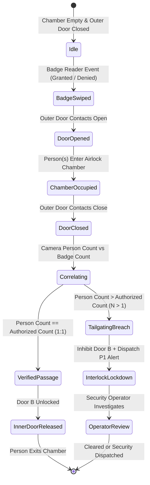

# Access Control Tailgating & Airlock Detection (`analytics.tailgating`)

## Executive Overview
**Access Control Tailgating Detection** is an authoritative, high-security surveillance capability designed for banking vaults, currency chests, data centers, and critical infrastructure airlocks (mantraps). It performs deterministic sequence correlation between Physical Access Control System (PACS) electronic badge swipe events and camera person counts inside interlocking portal chambers to detect unauthorized followers, piggybacking, and unbadged intrusions with zero false assumptions.

---

## Architecture & Sequence Correlation Engine

### 1. Airlock Portal Topology
An airlock portal consists of:
- **Outer Door (Door A)**: Entry door from unsecured lobby into the airlock vestibule / mantrap. Equipped with badge/biometric reader and door contact sensors.
- **Airlock Chamber**: Confined physical buffer zone between doors monitored by an overhead or interior camera.
- **Inner Door (Door B)**: High-security barrier leading into the vault or protected zone. Interlocked with Door A so that both doors can never be opened simultaneously.

```
       [ LOBBY ]
           │
      [Outer Reader] (Badge Swipe: GRANTED / DENIED)
           │
   ┌───────▼───────┐
   │  Outer Door   │ (State: OPENED -> CLOSED)
   ├───────────────┤
   │ Airlock Zone  │ ◄─── Overhead Camera (Person Detection & Tracking)
   │ (Single User) │      Max Allowed Occupancy = 1
   ├───────────────┤
   │  Inner Door   │ (Interlock: INHIBITED if Tailgating Detected)
   └───────┬───────┘
           │
     [ SECURE VAULT ]
```

### 2. Sequence Correlation State Machine


---

## Violation Classification Rules

1. **Piggybacking / Group Tailgating (`piggyback_tailgating`)**:
   - Authorized badge swipe granted for 1 person ($C_{auth} = 1$).
   - Camera person tracking detects 2 or more individuals entering or occupying the airlock vestibule ($C_{camera} > C_{auth}$).
   - **Severity**: `P1 (Critical)`
   - **Response**: Automatic inner door lock inhibit + audible local alarm + security incident dispatch.

2. **Unbadged Entry (`unbadged_entry`)**:
   - Zero authorized badge swipe events recorded within the correlation window ($C_{auth} = 0$).
   - Camera detects 1 or more individuals inside the airlock chamber.
   - **Severity**: `P1 (Critical)`
   - **Response**: Lockdown + immediate security dispatch.

3. **Denied Entry Breach (`denied_entry_breach`)**:
   - Access control badge swipe returned `DENIED`.
   - Camera detects entry through door contact into the airlock chamber.
   - **Severity**: `P1 (Critical)`
   - **Response**: Lockdown + immediate escalation.

4. **Chamber Multi-Occupancy (`multi_occupancy_violation`)**:
   - Airlock policy strictly limits occupancy to 1 person.
   - Camera observes simultaneous occupancy exceeding portal configuration ($N > N_{max}$).
   - **Severity**: `P2 (High)`

5. **Door Held / Propped Open Breach (`door_held_breach`)**:
   - Door magnetic contact remains opened beyond configured threshold, permitting multiple unverified entries.
   - **Severity**: `P2 (High)`

---

## Interlock Safety & Response

When a tailgating breach is confirmed by the sequence correlator:
- **Inner Door Inhibit**: An automated `interlockLockdown = true` signal prevents Door B from opening, trapping the intruder in the airlock chamber and protecting vault assets.
- **Surveillance Incident Generation**: A high-priority `TAILGATING` alert is published with camera track IDs, relative timeline offsets, and snapshot reference.
- **Operator Review Workflow**: Central security station operators can inspect the incident sequence, view the exact millisecond offsets, and confirm or clear the alarm.

---

## REST API Reference

### 1. List Tailgating Incidents
`GET /v1/analytics/tailgating/events`
Query parameters:
- `portalId`: Airlock portal UUID
- `severity`: `P1` | `P2` | `P3`
- `reviewStatus`: `pending` | `confirmed` | `false_positive` | `escalated`
- `violationType`: `piggyback_tailgating` | `unbadged_entry` | `denied_entry_breach` | `multi_occupancy_violation` | `door_held_breach`
- `fromDate` / `toDate`: ISO 8601 timestamps
- `limit` (default 50), `offset` (default 0)

### 2. Live Sequence Correlation
`POST /v1/analytics/tailgating/correlate`
Payload:
```json
{
  "portalId": "11111111-1111-4111-8111-111111111111",
  "badgeSwipes": [
    {
      "doorId": "DOOR-VAULT-OUTER",
      "badgeId": "BADGE-104",
      "personName": "Jane Doe",
      "eventType": "granted",
      "authorizedCount": 1,
      "timestamp": 1726130000000
    }
  ],
  "doorEvents": [
    { "doorId": "DOOR-VAULT-OUTER", "state": "opened", "timestamp": 1726130001000 },
    { "doorId": "DOOR-VAULT-OUTER", "state": "closed", "timestamp": 1726130003000 }
  ],
  "cameraObservations": [
    {
      "trackId": "track-1",
      "timestamp": 1726130002000,
      "confidence": 0.95,
      "boundingBox": { "x": 0.3, "y": 0.3, "width": 0.2, "height": 0.4 }
    },
    {
      "trackId": "track-2",
      "timestamp": 1726130002500,
      "confidence": 0.92,
      "boundingBox": { "x": 0.5, "y": 0.3, "width": 0.2, "height": 0.4 }
    }
  ]
}
```

### 3. Ingest Badge Swipe
`POST /v1/analytics/tailgating/badge-swipe`
Payload:
```json
{
  "doorId": "DOOR-VAULT-OUTER",
  "badgeId": "BADGE-104",
  "personName": "Jane Doe",
  "eventType": "granted",
  "authorizedCount": 1,
  "direction": "entry"
}
```

### 4. Operator Review
`POST /v1/analytics/tailgating/events/:id/review`
Payload:
```json
{
  "reviewStatus": "confirmed",
  "reviewNotes": "CCTV verified second person entered behind authorized custodian. Guard dispatched."
}
```
