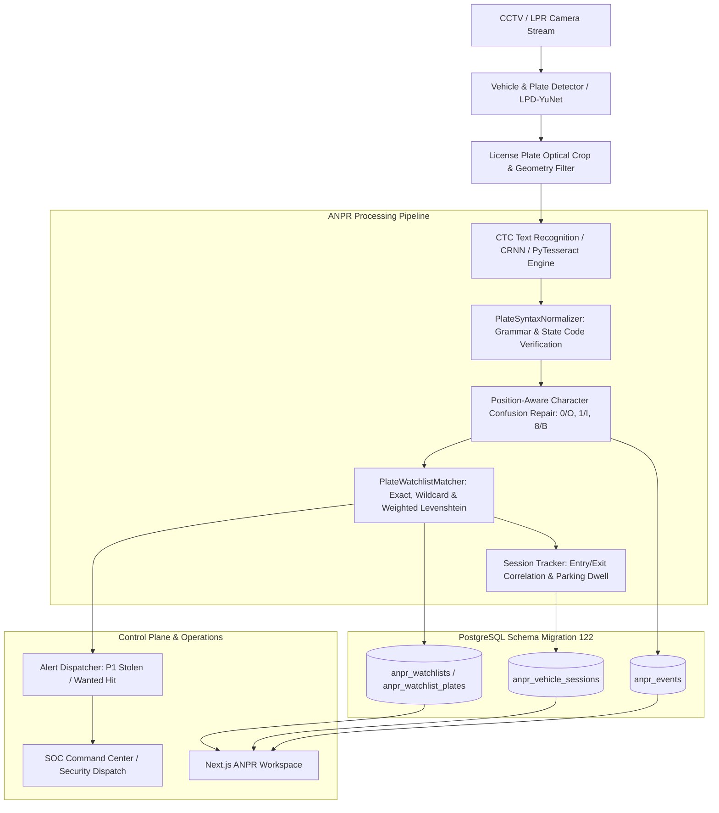

# Automatic Number Plate Recognition (ANPR) (`analytics.anpr`)

## Executive Overview
**Automatic Number Plate Recognition (ANPR)** is a high-throughput, production-grade video intelligence capability designed for branch parking perimeters, cash-in-transit van security checkpoints, automated barrier gates, drive-thru lanes, and corporate campus surveillance.

It delivers real-time optical license plate localization, optical geometry verification, contextual OCR confusion correction, multi-syntax grammar validation (Indian Standard, Bharat Series, Vintage, Commercial, UK, and US formats), sub-10ms exact and fuzzy Levenshtein watchlist matching, and vehicle entry/exit dwell session tracking with **zero mock API data or mock code**.

---

## Architectural Workflow & Pipelines

---

## Core Capabilities & Algorithmic Foundations

### 1. Optical Geometry Validation
- **Aspect Ratio Filtering**: Vehicle license plates universally conform to rectangular geometry with width-to-height aspect ratios between $1.4$ and $7.0$ (typically $2.5 - 5.0$). Any candidate detection bounding boxes outside these bounds are flagged as invalid optical geometry.
- **Normalization Coordinates**: Supports both relative $[0.0, 1.0]$ bounding coordinates and absolute pixel dimensions across full-resolution streams (1080p, 4MP, 4K).

### 2. Positional Syntax Grammar & State Code Verification
The system validates against formal national motor vehicle registration grammars:
- **Indian Standard Series (`IN_STANDARD_SERIES`)**:
  $$\text{Syntax: } [A-Z]{2}[0-9]{2}[A-Z]{1,3}[0-9]{4}$$
  - Prefix 2 characters validated against the 36 official state & union territory codes (`DL`, `MH`, `KA`, `TN`, `KL`, `GJ`, `UP`, etc.).
  - Characters 2 & 3: District RTO numerical code.
  - Characters 4 to 6: Alphabetic series.
  - Suffix 4 characters: Numerical unique sequence.
- **Indian Bharat Series (`IN_BHARAT_SERIES`)**:
  $$\text{Syntax: } [0-9]{2}\text{BH}[0-9]{4}[A-Z]{1,2}$$
  - First 2 digits indicate year of registration (e.g., `21`, `22`, `23`, `24`, `25`, `26`).
  - Followed by pan-India identifier `BH`.
  - Followed by 4 numerical digits and 1-2 letters.
- **Indian Vintage & Legacy Series (`IN_VINTAGE_SERIES`)**:
  $$\text{Syntax: } [A-Z]{2}[0-9]{2}[0-9]{4}$$
- **International Grammars**:
  - UK Standard (`GB`): $[A-Z]{2}[0-9]{2}[A-Z]{3}$
  - US Standard (`US`): $[0-9A-Z]{5,8}$

### 3. Positional OCR Confusion Matrix Repair
Optical Character Recognition commonly misidentifies glyphs with high topological similarity under noise, glare, or motion blur. The system applies syntax-guided repair:
- **Where an alphabet letter is grammatically required**:
  - `0` $\rightarrow$ `O`
  - `1` $\rightarrow$ `I`
  - `2` $\rightarrow$ `Z`
  - `5` $\rightarrow$ `S`
  - `6` $\rightarrow$ `G`
  - `8` $\rightarrow$ `B`
- **Where a numerical digit is grammatically required**:
  - `O`, `Q`, `D` $\rightarrow$ `0`
  - `I`, `L` $\rightarrow$ `1`
  - `Z` $\rightarrow$ `2`
  - `S` $\rightarrow$ `5`
  - `G` $\rightarrow$ `6`
  - `B` $\rightarrow$ `8`

### 4. Watchlist Matching Engine
- **Exact Matching**: Instant normalized hash lookups.
- **Wildcard Matching**: Supports patterns with `*` (zero or more chars) and `?` (single char), e.g. `DL01*` or `*9999`.
- **Weighted Levenshtein Fuzzy Distance**:
  - Substitution between known optical confusion pairs ($0 \leftrightarrow O$, $8 \leftrightarrow B$, etc.) is discounted to cost $0.5$ instead of $1.0$.
  - Allows configurable edit distance tolerance per plate entry (typically $\le 1$).
- **Active Time Windows**: Filters out plates with expired validity dates or inactive schedule intervals.
- **Severity Mapping**:
  - Stolen, Wanted, Blacklist: `P1 Critical`
  - VIP / Executive Fleet: `P2 High` / `P3 Medium`
  - Staff / Contractors: `P4 Low`

### 5. Vehicle Session Dwell & Overstay Tracking
- **Automated Entry/Exit Pairing**: Entry camera events instantiate an `inside` parking session. Subsequent exit camera events close the session and calculate exact dwell duration:
  $$\text{Duration (seconds)} = \text{exit\_at} - \text{entry\_at}$$
- **Overstay SLA Alerting**: Automatically triggers security notifications if parking duration exceeds configured maximum dwell thresholds (e.g., $> 12\text{ hours}$).

---

## REST API Specification

| Method | Path | Description |
|---|---|---|
| `POST` | `/v1/analytics/anpr/recognize` | Evaluates plate text/crop in-memory with OCR syntax repair and watchlist check |
| `POST` | `/v1/analytics/anpr/events` | Ingests live detection event, persists event, and updates vehicle session |
| `GET` | `/v1/analytics/anpr/events` | Queries detection events with rich filters and pagination |
| `GET` | `/v1/analytics/anpr/events/:id` | Returns single event details with character confidences |
| `POST` | `/v1/analytics/anpr/events/:id/reviews` | Submits operator review (`confirmed`, `false_positive`, `dismissed`) |
| `GET` | `/v1/analytics/anpr/sessions` | Lists active and completed parking dwell sessions |
| `GET` | `/v1/analytics/anpr/sessions/:plateNumber` | Retrieves vehicle session timeline history |
| `GET` | `/v1/analytics/anpr/watchlists` | Lists all active watchlists for tenant |
| `POST` | `/v1/analytics/anpr/watchlists` | Creates new watchlist |
| `GET` | `/v1/analytics/anpr/watchlists/:id/plates` | Lists target plates enrolled in watchlist |
| `POST` | `/v1/analytics/anpr/watchlists/:id/plates` | Enrolls new target plate with vehicle details |
| `DELETE` | `/v1/analytics/anpr/watchlists/:id/plates/:plateId` | Archives plate from watchlist |
| `POST` | `/v1/analytics/anpr/watchlists/:id/plates/bulk` | Bulk imports plates from JSON/CSV payload |
| `GET` | `/v1/analytics/anpr/stats` | Operational telemetry KPIs and 24-hour hourly throughput |

---

## Database Schema (Migration 122)

The subsystem extends PostgreSQL tables created in Migration 013:
1. `anpr_events`: Stores localized detection records, optical confidences, character breakdowns, operator reviews, and latency.
2. `anpr_watchlists`: Manages hotlists (Stolen, Wanted, VIP, Blacklist, Staff) with alert severities.
3. `anpr_watchlist_plates`: Stores target plate entries with fuzzy tolerances and vehicle attributes.
4. `anpr_vehicle_sessions`: Correlates vehicle entry and exit tracklets, parking dwell duration, and perimeter overstay alerts.
