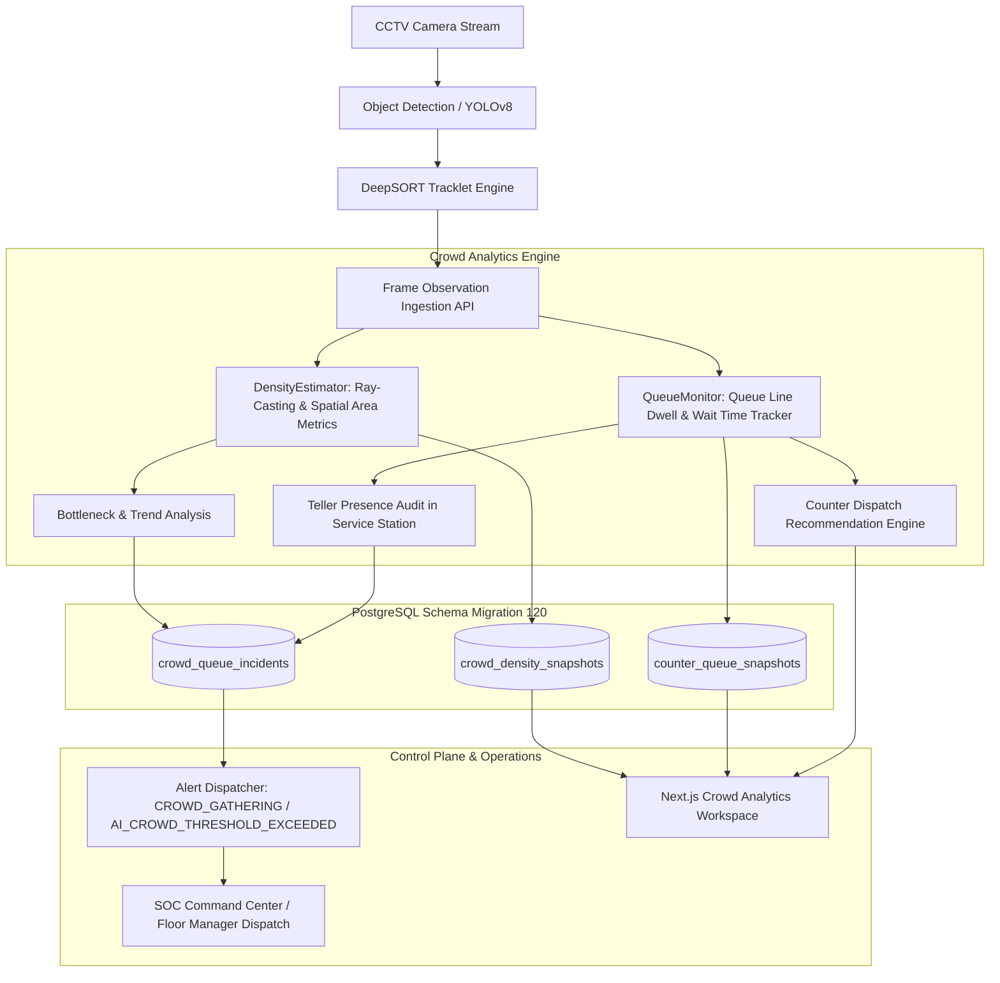

# Crowd Density & Queue Length Detection (`analytics.crowd`)

## Executive Overview
**Crowd Density & Queue Length Detection** is a production-grade video analytics and operational intelligence system designed for branch banking halls, customer lounges, cash counter areas, ATM vestibules, and commercial service centers. 

It provides real-time spatial crowd density estimation, choke-point stagnation & bottleneck analysis, counter queue depth tracking, wait time SLA breach detection, teller attendance auditing, and smart counter opening recommendations with **zero mock data**.

---

## Architectural Workflow & Pipelines

---

## Key Capabilities & Algorithms

### 1. Spatial Geometry & Ray-Casting Density Estimation
- **Polygonal Zone Modeling**: Allows arbitrary concave or convex polygonal boundaries defining branch halls, customer lounges, ATM vestibules, and teller areas.
- **Ray-Casting Point-in-Polygon Engine**: Computes bounding box centroids and tests inclusion with sub-millisecond overhead.
- **Area Saturation & Metric Density**: Computes persons per square meter ($m^2$) and percentage of nominal, warning, and maximum designed physical capacities.
- **Density Level Classification**:
  - `empty`: 0 persons
  - `sparse`: $< 30\%$ nominal capacity
  - `normal`: $30\% - 100\%$ nominal capacity
  - `crowded`: Exceeds nominal capacity up to warning capacity
  - `overcrowded`: Exceeds warning capacity up to max capacity
  - `dangerous`: Exceeds maximum physical capacity (surge alert triggered)
- **Bottleneck Choke-Point Detection**: Flags high-density accumulations where average person movement velocity drops below $0.15\text{ m/s}$ (stagnant stampede risk).
- **Growth Trend Regression**: Rolling count time-series regression to project crowd surges (`increasing`, `decreasing`, `stable`).

### 2. Counter Queue Depth & Wait Time SLA Monitoring
- **Dual Polygon Counter Topology**:
  - **Queue Line Polygon**: Where waiting customers stand in line.
  - **Service Station Polygon**: Where the counter teller stands and the customer at the head of the queue is served.
- **Per-Person Dwell & Wait Time Tracking**: Tracks individual tracklets from arrival timestamp, calculating real-time elapsed wait seconds, average wait time, and maximum wait time in queue.
- **Teller Attendance Auditing**: Evaluates person presence inside the service station. Detects and flags `unattended_counter_with_queue` when customers wait with no teller present for $> 30\text{ seconds}$ (`P1 Critical`).
- **Abandonment Detection**: Detects individuals who departed the queue without service after waiting $> 30\text{ seconds}$.
- **Throughput & Service Rate**: Measures completed transactions and served customer count per hour.
- **Smart Counter Recommendation Engine**: Analyzes branch queue loads across all counters and recommends opening specific standby counters when active queues exceed service thresholds.

---

## Database Architecture (`database/migrations/120_crowd_density_and_queue_length.sql`)

1. **`crowd_monitoring_zones`**: Master definitions of polygonal zones, area ($m^2$), and capacity thresholds.
2. **`counter_queues`**: Teller and service counter configurations, queue geometries, service polygons, queue limits, and SLA wait thresholds.
3. **`crowd_density_snapshots`**: High-resolution audit time-series documenting person counts, density per $m^2$, occupancy percentage, velocity, and bottlenecks.
4. **`counter_queue_snapshots`**: Real-time counter metrics recording queue lengths, served customer counts, average & max wait times, and teller attendance.
5. **`crowd_queue_incidents`**: Authoritative incident ledger for threshold violations:
   - `crowd_density_exceeded`
   - `queue_length_exceeded`
   - `wait_time_sla_breach`
   - `unattended_counter_with_queue`
   - `stampede_risk_bottleneck`
6. **`crowd_queue_configs`**: Tenant and branch-level default threshold policies, SLA criteria, and counter auto-dispatch configurations.

---

## Fastify REST API Endpoints (`/v1/analytics/crowd`)

| Method | Endpoint | Description |
|---|---|---|
| `GET` | `/v1/analytics/crowd/zones` | List monitored branch hall zones |
| `POST` | `/v1/analytics/crowd/zones` | Create or update a monitoring zone |
| `DELETE` | `/v1/analytics/crowd/zones/:id` | Delete a monitoring zone |
| `GET` | `/v1/analytics/crowd/queues` | List counter queues |
| `POST` | `/v1/analytics/crowd/queues` | Create or update a counter queue |
| `DELETE` | `/v1/analytics/crowd/queues/:id` | Delete a counter queue |
| `POST` | `/v1/analytics/crowd/analyze-frame` | Ingest real-time camera person detections and run pipeline |
| `GET` | `/v1/analytics/crowd/live` | Real-time live status for all zones, queues, and recommendations |
| `GET` | `/v1/analytics/crowd/density-history` | Time series historical crowd density snapshots |
| `GET` | `/v1/analytics/crowd/queue-metrics` | Historical counter queue length and wait time snapshots |
| `GET` | `/v1/analytics/crowd/incidents` | Filtered threshold breach incidents with pagination |
| `GET` | `/v1/analytics/crowd/incidents/:id` | Detailed single incident record |
| `POST` | `/v1/analytics/crowd/incidents/:id/review` | Operator review action (`acknowledged`, `resolved`, `false_positive`) |
| `GET` | `/v1/analytics/crowd/stats` | Aggregated branch KPIs (occupancy, peak density, SLA compliance) |
| `GET` | `/v1/analytics/crowd/recommendations` | Active counter opening and queue rebalancing recommendations |
| `GET` | `/v1/analytics/crowd/config` | Retrieve tenant/branch default thresholds |
| `PUT` | `/v1/analytics/crowd/config` | Update threshold configuration |

---

## Verification & Automated Test Suite

- Test Suite: `test/analytics/crowd-density-and-queue.test.ts`
- Tests Passed: **16 of 16 unit and integration tests**
- Capability Matrix Verification: `npm run verify:capability-truth` (Completely compliant)
- TypeScript Compilation: `npm run typecheck` and `npm run typecheck --workspace @sentinel/dashboard` (0 errors)
