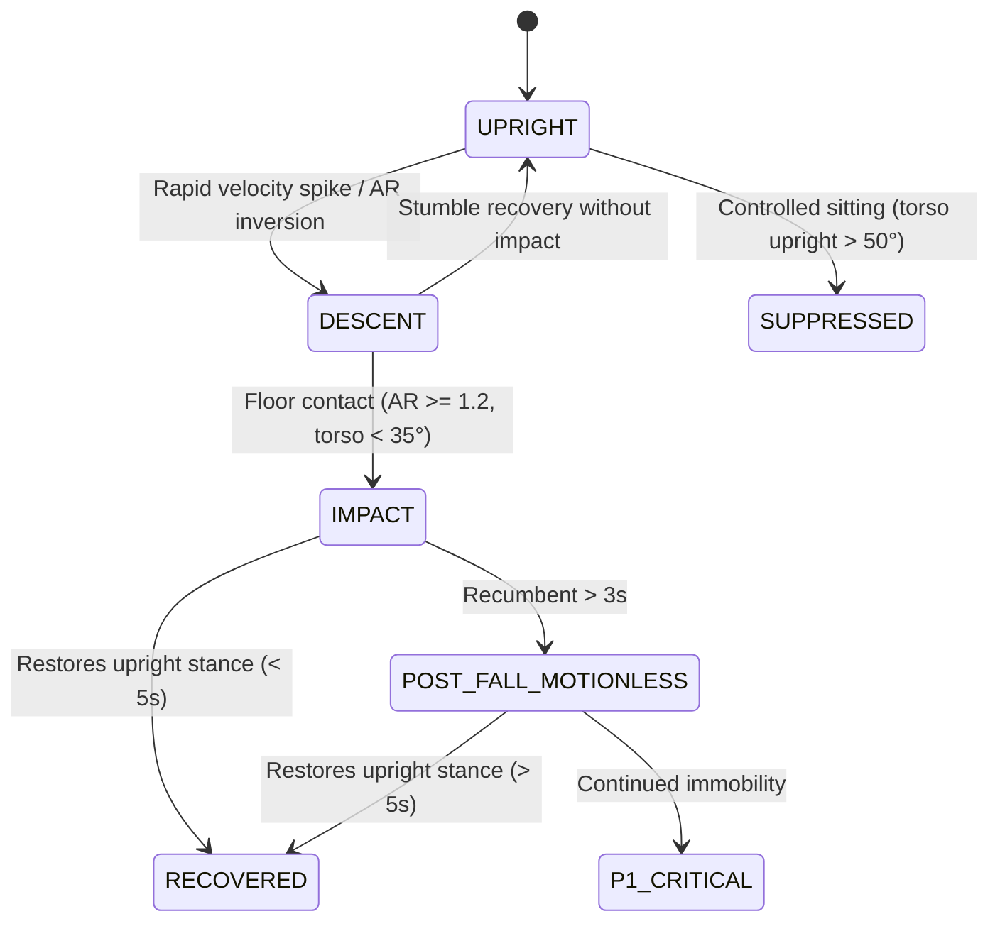

# Worker and Elderly Fall Detection (`analytics.fall_detection`)

## Architectural Overview

The **Worker & Elderly Fall Detection** engine is a multi-factor biomechanical analytics system designed to detect sudden falls, slips, trips, ladder/scaffolding collapses, and syncope fainting in mission-critical surveillance environments (industrial construction, factories, hospitals, assisted living, and nursing care).

The system fuses:
1. **Bounding Box Aspect Ratio Dynamics**: Tracks temporal inversion from vertical upright ($w/h \approx 0.3 - 0.7$) to recumbent floor horizontal ($w/h \ge 1.20$).
2. **Vertical Descent Velocity and Impact Deceleration Shock**: Tracks centroid velocity $v_y = \Delta y / \Delta t$ and deceleration shock upon ground plane contact.
3. **Pose Estimation Kinematics**: Computes torso inclination angle $\theta_{\text{torso}}$ relative to the horizontal floor plane, vertical span compression, and classifies directional trajectories (`forward`, `backward`, `sideways`, `slump`, `scaffold_drop`).
4. **Motionless / Inactivity State Monitoring**: Monitors prolonged post-impact immobility (the "Golden Hour" medical indicator) to trigger emergency escalations.
5. **False Positive Suppression**: Rejects intentional actions (controlled sitting, deliberate bending to tie shoes or pick up objects, and designated resting zones).

---

## Biomechanical Formulation

### 1. Aspect Ratio ($AR$) Dynamics
Let a tracked human bounding box at time $t$ have dimensions $(w_t, h_t)$:
$$AR_t = \frac{w_t}{h_t}$$
The rate of aspect ratio inversion is:
$$\frac{d(AR)}{dt} = \frac{AR_t - AR_{t-1}}{\Delta t}$$
- **Upright posture**: $AR < 0.85$
- **Fallen prone/supine posture**: $AR \ge 1.20$
- **Freefall / Collapse threshold**: $\frac{d(AR)}{dt} \ge 0.80\text{ s}^{-1}$

### 2. Vertical Centroid Kinematics
Given bounding box centroid $y_{c,t} = y_t + \frac{h_t}{2}$:
$$v_{y,t} = \frac{y_{c,t} - y_{c,t-1}}{\Delta t}$$
$$a_{y,t} = \frac{v_{y,t} - v_{y,t-1}}{\Delta t}$$
- Sudden downward drop: $v_{y,t} \ge v_{\text{threshold}}$ (default $0.15\text{ px/ms}$ or normalized units).
- Ground impact: $a_{y,t} \ll 0$ (sharp deceleration) with bounding box base $y + h$ stabilizing at the floor plane.

### 3. Torso Inclination Angle ($\theta_{\text{torso}}$)
Using shoulder midpoint $(x_s, y_s)$ and hip midpoint $(x_h, y_h)$:
$$\theta_{\text{torso}} = \arctan2(|y_s - y_h|, |x_s - x_h|) \times \frac{180}{\pi}$$
- **Standing/Walking**: $70^\circ \le \theta_{\text{torso}} \le 90^\circ$
- **Recumbent / Floor Impact**: $\theta_{\text{torso}} < 35^\circ$

---

## Profile Adaptation: Worker vs Elderly

| Parameter | Worker Profile (Industrial) | Elderly Care Profile |
| :--- | :--- | :--- |
| **Primary Risk Factors** | Scaffolding/ladder drop, slick floor slips, machinery impact | Syncope, loss of balance, slow slump, bed falls |
| **Velocity Threshold** | Standard ($0.150$) | Lowered by 30% ($0.105$) for slow collapse |
| **Descent Distance** | High vertical drop ($\Delta y > 80\text{px}$) triggers `scaffold_drop` | Knee buckling detection triggers `slump` |
| **Motionless Timer** | $3.0\text{ s}$ delay before P1 | $3.0\text{ s}$ delay before P1; golden hour alert |
| **Recovery Window** | $15.0\text{ s}$ | $20.0\text{ s}$ |

---

## State Machine Pipeline

---

## Database Ledger Schema

The persistence layer (`database/migrations/122_fall_detection_hardening.sql`) provisions:
- `fall_detection_events`: Immutable audit ledger storing:
  - `track_id`, `person_category`, `fall_type`, `confidence`, `severity`
  - `impact_speed`, `aspect_ratio_peak`, `torso_angle_degrees`, `motionless_duration_seconds`
  - `recovery_detected`, `recovery_time_seconds`, `bounding_box`, `pose_keypoints`, `dynamics_telemetry`
  - `review_status` (`pending`, `confirmed`, `false_positive`, `escalated`)
- `fall_detection_configs`: Per-camera parameter overrides (`profile`, `sensitivity`, `thresholds`, `timers`).

---

## Production API Endpoints

- `GET /v1/analytics/fall/events`: Query events with camera, category, severity, and date filters.
- `GET /v1/analytics/fall/events/:id`: Retrieve single event forensic telemetry.
- `POST /v1/analytics/fall/events/:id/review`: Operator verification and review notes.
- `GET /v1/analytics/fall/config/:cameraId`: Fetch camera configuration.
- `PUT /v1/analytics/fall/config/:cameraId`: Update sensitivity and thresholds.
- `GET /v1/analytics/fall/stats`: Operational KPI metrics.
- `POST /v1/analytics/fall/detect`: Live stream ingestion endpoint.
