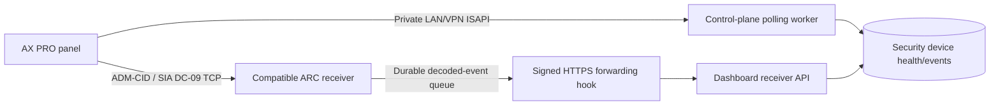

# AX PRO deployment and panel setup

Updated 10 October 2026. Application hardening is implemented and tested locally. No production deployment or panel configuration has been performed. Hardware acceptance remains outstanding.

## Supplied panel

The screenshots show **DS-PWA64-L-WB**, firmware **V1.3.0 build 250430**, one disarmed area, seven normal zones and 90% battery. Ethernet and cloud service appear connected; Wi-Fi appears disconnected. These are screenshot observations, not live telemetry.

The ARC screen shows **IP / ADM-CID / TCP**, empty server address, port and account code, 20-second acknowledgement timeout and three retransmissions. The overview reports no configured receiving center.

Hikvision documents this panel family with SIA DC-09/Contact ID, ISUP and ISAPI support. Exact endpoints and event vocabulary must be checked for this firmware: [official panel leaflet](https://www.hikvision.com/content/dam/hikvision/en/brochures-download/product-leaflet/AX-PRO-Panel-.pdf), [AX PRO manual](https://www.hikvision.com/content/dam/hikvision/products/S000000001/S000000601/S000000937/S000000938/OFR001810/M000044452/User_Manual/UD25814B_Baseline_AX-PRO-_User-Manual_v1.2.7_202209.pdf), [model-specific developer documentation](https://tpp.hikvision.com/download/).

## Connection path



The photographed ARC workflow needs a compatible receiver, such as a correctly configured Hik-IP Receiver installation or a receiver verified for this panel's DC-09 mode. Wire its decoded-event export to the forwarding hook below. **This repository does not implement raw TCP/UDP DC-09 receiving, native ARC ACKs, AES DC-09 decryption or Hik-Partner Pro cloud API access.** The HTTPS API cannot be entered as an ADM-CID TCP receiving center.

Direct ISAPI polling needs an actual private network/VPN route from the control plane to the panel. Dashboard connection tests/discovery also need that route. The existing camera edge-agent tunnel does not expose AX PRO ISAPI automatically.

For an ARC-only installation, keep ISAPI polling disabled. Create the integration with the known panel LAN address and register an approved `AX_PRO_HUB` in device inventory with the correct tenant/branch, `metadata.axProIntegrationId` and `metadata.axProConfig` from that integration. Associate peripherals with verified `metadata.axProDeviceId` zone identities. ISAPI discovery stages this information when private access exists; receiver events alone do not discover inventory.

## Application changes

- Browser APIs validate the session against the control plane, use its verified tenant and require a super/company/HQ administrator. Cross-site writes and mandatory-password-change accounts are rejected. Creation verifies branch ownership.
- Database access uses the canonical PostgreSQL pool/TLS policy. Credentials stay in the vault; secret-provider requests use bounded HTTPS in production.
- HTTP requests negotiate digest without preemptive Basic, support MD5/SHA-256 digest variants, reject redirects and malformed JSON/XML/entity declarations, preserve endpoint query parameters and enforce deadlines through body streaming with a 1 MiB cap. XML zone/event IDs retain leading zeroes.
- The optional control-plane worker polls up to four panels concurrently, reducing concurrency for small database pools. It respects intervals, retries failures and drains on shutdown. Advisory locks prevent overlapping manual/replica polls.
- Polling records the approved source device's health. Hub telemetry is not presented as individual telemetry for every peripheral; peripheral health is available through the configured adapter/device-health API.
- Event rows, counters and polling cursor commit together. Tests/discovery do not advance that cursor; polling overlaps by 30 seconds. Push updates counters without moving it. Daily counters use the database calendar date.
- Production push requires an integration-specific secret and timestamp within five minutes. Duplicate deliveries are acknowledged without incrementing counters. Stable identities tolerate key ordering and hub re-enrollment.
- Disarm/restoration/intrusion mappings are corrected. Unknown vendor codes stay INFO events for review. Integrations can be paused/enabled; paused integrations reject polling/push. Connection tests do not enable them.

## Migrate and configure

Run `npm run db:migrate` against the intended deployment database before starting this build. New `091_axpro_schema_prerequisites.sql` supplies tables before immutable migration 092; migration 146 remains compatible. `20261010_axpro_production_runtime.sql` adds runtime columns, P0–P4 severity compatibility and integration-scoped event identity. Existing migration files were not rewritten.

Use [deploy/axpro.env.example](../deploy/axpro.env.example) for settings:

| Setting | Service | Purpose |
| --- | --- | --- |
| `DATABASE_URL` and canonical DB TLS/CA settings | Dashboard + control plane | Shared database |
| `AXPRO_SECRET_VAULT_PROVIDER` | Both | `HASHICORP_VAULT` or `HTTP_JSON` |
| `AXPRO_SECRET_VAULT_ENDPOINT` | Both | HTTPS vault endpoint |
| `AXPRO_SECRET_VAULT_TOKEN` / namespace | Both | Private restricted credentials |
| `AXPRO_POLLING_ENABLED=true` | Control plane | Enable ISAPI worker after private routing is verified |
| `AXPRO_RECEIVER_SECRETS` | Dashboard | Private JSON map: `tenant-id:integration-id` to a random secret of at least 32 characters |

Compose templates now pass these variables. Polling defaults to false. The GCP dashboard matches its control plane's existing private-container DB transport policy; external deployments should configure verified TLS/CA material. Never use `NEXT_PUBLIC_` for credentials or receiver secrets.

Vault reference example: `secret://branches/<branch-id>#axpro`. Its value must contain JSON `username` and `password`. HashiCorp KV v2 references must include the correct mount/data path. Trust the panel/enterprise CA in Node when required; do not disable global TLS verification.

## Setup screens

1. Sign in as an administrator and open `/settings/integrations/hikvision/ax-pro`.
2. Enter the actual branch UUID, panel address, HTTPS port and vault reference.
3. Keep `/ISAPI/System/deviceInfo`. Configure capabilities, zone, status and event endpoints only after firmware-specific verification; leave unsupported paths empty.
4. Test, discover, then approve/enroll identified devices in the hub. Verify zone identities against physical sensors.
5. Use `/security-devices/integrations` to test, poll, pause or enable.

The optional events endpoint must return a complete bounded batch for the ISO `since` query, or be a bridge implementing that contract. Native streaming `alertStream` and vendor-specific paginated searches are not supported by this snapshot polling client. Use receiver push for these workflows. A health-only poll does not advance the event cursor.

## Receiver export hook

The ARC receiver must durably queue decoded records with stable IDs and verified semantics:

```json
{
  "eventId": "receiver-persisted-event-000001",
  "eventType": "panic",
  "zoneId": "7",
  "dateTime": "2026-10-10T15:30:00+05:30"
}
```

For Contact ID, decode the event code and qualifier, including alarm versus restoration. Do not map every numeric code to an intrusion/panic. Retain unmapped codes and verify `eventTypeMap` using real examples.

On the receiver host, privately set `AXPRO_FORWARD_BASE_URL=https://<dashboard-domain>`, `AXPRO_FORWARD_TENANT_ID`, `AXPRO_FORWARD_INTEGRATION_ID` and `AXPRO_FORWARD_SECRET` matching the dashboard's integration-specific secret. Invoke from its durable delivery workflow:

```text
node scripts/axpro-forward-event.mjs queued-event.json
```

The script signs and POSTs original file bytes to `/api/security-devices/integrations/<id>/events` and leaves the file intact. Signature: `HMAC-SHA256(secret, timestamp + "." + rawBody)`. Headers: `x-sentinel-tenant-id`, `x-sentinel-axpro-timestamp` (Unix seconds), `x-sentinel-axpro-signature` (`sha256=<hex>`).

202 means a committed event or durable duplicate recognition. Retain/retry on timeout or non-202 with a fresh timestamp/signature. The upstream receiver owns the durable queue and native protocol ACK; this script is the HTTPS forwarding hook, not an ARC listener.

## Photographed ARC settings

| Field | What to enter |
| --- | --- |
| Connection | IP |
| Protocol | ADM-CID if the deployed receiver confirms support, otherwise its verified SIA DC-09 mode |
| Transmission | TCP matching that receiver listener |
| Server address | Receiver IP/domain supplied after deployment |
| Port | Its TCP listening port, not the dashboard HTTPS port |
| Account code | Receiver-assigned unique account bound to this tenant/branch/panel |
| ACK/retransmissions | Receiver-approved values; screenshot currently shows 20 seconds / 3 attempts |
| Polling / periodic test | Receiver supervision policy, with heartbeat handling verified |
| Push categories | Required alarms, faults, operations and general events after mapping validation |

The screenshots do not provide a verified receiver address/port/account, deployed receiver or panel LAN IP. These cannot be derived from the Hik-Partner Pro URL. Obtain them before Save/Test. Public ARC delivery requires the receiver's verified authentication/encryption mode.

## Verification and rollout

```text
npm test -- test/axpro.test.ts test/axpro-api.test.ts test/axpro-forwarder.test.ts test/security-device-discovery.test.ts
npm run typecheck
npm run dashboard:typecheck
node scripts/test-axpro-migrations.mjs
```

The migration test uses a disposable PostgreSQL 17 Docker container without host ports or persistent volumes and does not read a production DB URL. It checks fresh ordering, replay, P1 severity, deduplication, cursor columns and locks. Unit/API tests exercise digest, body limits/deadlines, malformed input, signing, authorization, disabled integrations, transaction rollback, duplicate counters, cursor isolation and recovery. Forwarding tests verify exact-byte signatures and preserve queued files on rejection/timeout.

Before branch activation, test native ARC communication, alarm/restore, arm/disarm, tamper/restore, power-loss/restore, battery/fault and communication-loss supervision. Verify tenant, branch and zone. Replay an event, disconnect/reconnect delivery and verify queue recovery, then test wrong secrets/timestamps and pause/re-enable. Confirm the desired control-room/notification workflow consumes these security-device events; storing them alone does not guarantee SMS/email.

Receiver deployment/export wiring, private reachability, hardware acceptance and production rollout remain outstanding. To stop the integration, pause it and disable the polling worker; preserve receiver queues. The additive schema can remain during application rollback.
