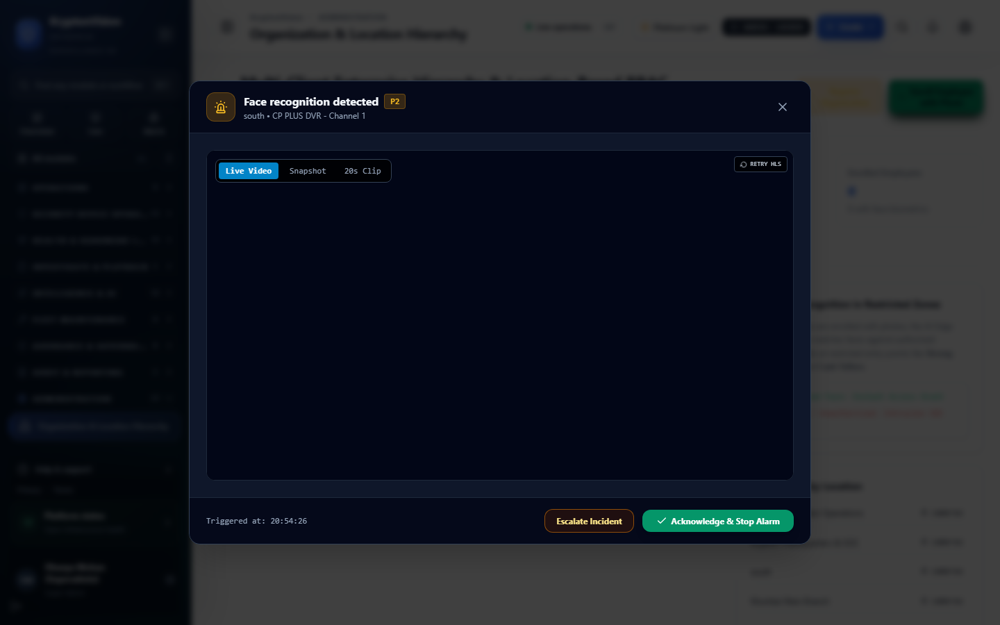
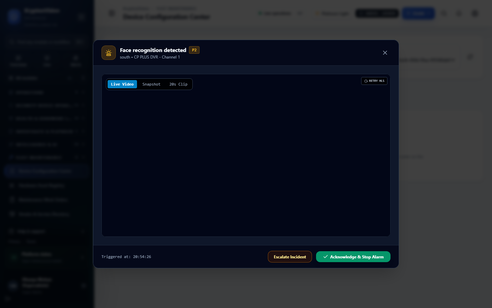
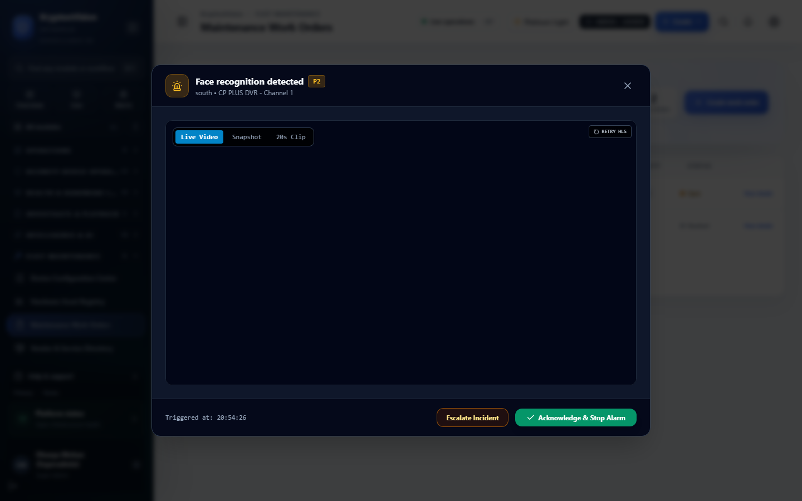

# Sentinel Grid — Administrator Manual

**Product Version:** Sentinel Grid 0.1.0  
**Dashboard Version:** @sentinel/dashboard 0.1.0  
**Document Version:** 1.0.0  
**Last Updated:** September 5, 2026  
**Audience:** System Administrators, Tenant Administrators, NBFC Security Administrators, IT Operations  

---

## Table of Contents

1. [System Overview & Architecture](#1-system-overview--architecture)
2. [Organization & Location Hierarchy](#2-organization--location-hierarchy)
3. [Identity & Access Management (RBAC / ABAC)](#3-identity--access-management-rbac--abac)
4. [Device Management & Discovery](#4-device-management--discovery)
5. [Camera & Stream Configuration](#5-camera--stream-configuration)
6. [Recording Policies & Storage Management](#6-recording-policies--storage-management)
7. [AI Rules & Visual Automation Configuration](#7-ai-rules--visual-automation-configuration)
8. [Notification Subsystem Configuration](#8-notification-subsystem-configuration)
9. [Immutable Audit Ledger & Security Compliance](#9-immutable-audit-ledger--security-compliance)
10. [Hardware Asset Management & Maintenance](#10-hardware-asset-management--maintenance)
11. [Administrator Screenshot Map & UI Reference](#11-administrator-screenshot-map--ui-reference)

---

## 1. System Overview & Architecture

Sentinel Grid operates as a distributed, high-availability video surveillance platform composed of the following core system modules:

```text
                       [Edge Reverse Proxy (Caddy / Ports 80, 443)]
                                       │
            ┌──────────────────────────┼──────────────────────────┐
            ▼                          ▼                          ▼
   [Dashboard / Next.js]       [Control Plane API]      [Media Gateway]
      (Port 10000)                (Port 8080)        (Ports 8090/8554/8888)
            │                          │                          │
            │                          ▼                          │
            │               ┌──────────────────────┐              │
            │               │ Redis 7 (Leases/Pub) │              │
            │               │ Postgres 16 (Rel/Vec)│              │
            │               └──────────────────────┘              │
            ▼                          │                          ▼
   [Analytics Engine] ◄────────────────┴────────────────► [Recording Engine]
      (Port 8092)                                            (Port 8091)
            │                                                     │
     (AI Detectors)                                         (POSIX / NVMe)
                                                            (NFS / SMB / S3)
```

### Architectural Guarantees & Enforcement
* **Single Authoritative Codepaths:** Adheres strictly to `ARCHITECTURE_AUTHORITY.md`. Identity flows route through `packages/identity` and `src/security/*`; recording indexes operate via `src/recording-index/recording-index.service.ts`.
* **Zero Process-Local State for Global Truth:** Stream leases, viewer allocations, camera ownership, and recording locks reside in Redis with explicit lease epochs (`(cameraId, ownerNodeId, leaseEpoch)`).
* **Fail-Closed Capability Model:** Features not fully verified are classified under `BETA`, `EXPERIMENTAL`, or `NOT_IMPLEMENTED` in `docs/CAPABILITY_AUDIT.md`. Deceptive UI controls are blocked in CI and runtime.

---

## 2. Organization & Location Hierarchy

Sentinel Grid enforces a strict physical and organizational multi-tenant tree:

```text
Tenant (Organization)
 └── Region (e.g., North, West, South)
      └── Branch (e.g., Koramangala Gold Loan Branch #104)
           └── Floor / Zone (e.g., Ground Floor, Vault Room)
                └── Device Nodes (Cameras, Recorders, Sensors)
```


*Figure 2.1: Organization & Location Hierarchy Administration (`/admin/organization`)*

### Workflow: Provisioning a New Branch
1. Navigate to **Organization Administration** (`/admin/organization?tab=hierarchy`).
2. Select the target **Region** from the tree.
3. Click **Add Branch**.
4. Configure branch parameters:
   * **Branch Name & Code:** (e.g., *Indiranagar Branch*, `BLR-IND-01`).
   * **Operating Hours:** Business opening (e.g., `09:00`) and closing (e.g., `18:00`) in `Asia/Kolkata` (IST).
   * **Emergency Contact Details:** Branch manager phone, local police station number, and security agency dispatch hotline.
5. Click **Create Branch**.
6. *(Optional)* Launch the **Branch Onboarding Wizard** (`/admin/branch-onboarding`) for automated bulk camera assignment and edge agent bootstrap.

---

## 3. Identity & Access Management (RBAC / ABAC)

Authentication and authorization in Sentinel Grid combine Role-Based Access Control (RBAC) with Attribute-Based Access Control (ABAC) resource scoping:

### System Roles
* `super_admin`: Full system control across all tenants, branches, system settings, and audit logs.
* `tenant_admin`: Administrative access scoped to an entire tenant organization.
* `soc_operator`: 24x7 monitoring, live video viewing, PTZ operation, alert triage, and incident handling.
* `branch_manager`: Scoped visibility into their assigned branch only; live view, local alerts, and staff presence.
* `auditor`: Read-only access to immutable audit ledgers, compliance dashboards, and evidence verification.
* `maintenance_engineer`: Access to device configuration, camera diagnostics, and work orders.

### Granular Banking Permissions (`BankingPermissions`)
The following canonical permissions are enforced across API routes and dashboard actions:

| Category | Canonical Permission Key | Description |
| :--- | :--- | :--- |
| **Cameras** | `camera.live.view` | View real-time RTSP/WebRTC/HLS camera streams. |
| | `camera.playback.view` | Scrub and replay historical recordings. |
| | `camera.ptz.control` | Pan, tilt, zoom, and recall presets. |
| | `camera.configure` | Modify RTSP URLs, stream parameters, and device names. |
| | `camera.credentials.read`| Access unmasked camera administrative credentials. |
| **AI Rules** | `ai_rule.view` | View configured AI rules, zones, and schedules. |
| | `ai_rule.create` | Create new compound AI surveillance rules. |
| | `ai_rule.edit` | Modify rule thresholds, persistence duration, or actions. |
| | `ai_rule.approve` | Formally approve rules created by other staff (dual-control). |
| | `ai_rule.activate` | Promote shadow rules to live alerting state. |
| | `ai_rule.disable` | Deactivate active AI rules. |
| | `ai_rule.delete` | Delete non-active AI rule records. |
| | `ai_rule.test` | Run historical simulations or shadow test sessions. |
| | `ai_zone.manage` | Create, edit, and delete visual polygon/tripwire zones. |
| **Alerts & Incidents** | `alert.view` | Monitor real-time alarm queues. |
| | `alert.acknowledge` | Claim and acknowledge incoming alerts. |
| | `incident.create` | Promote alerts into formal investigation cases. |
| | `incident.close` | Close resolved incidents with root cause analysis. |
| **Evidence** | `evidence.view` | View evidence metadata and preview snapshots. |
| | `evidence.export` | Download signed forensic court ZIP packages. |
| | `evidence.legal_hold.create` | Lock recording segments against automated pruning. |
| | `evidence.legal_hold.release`| Remove legal hold protection with justification. |

### ABAC Location Scopes (`ResourceScope`)
Every user principal is assigned an explicit operational scope:
* `ALL_BRANCHES`: Fleet-wide visibility (SOC headquarters, executive officers).
* `REGION`: Restricted to branches within a geographic territory (Regional managers).
* `BRANCH`: Locked exclusively to a single branch code (Local branch staff).
* `CAMERA_GROUP`: Restricted to specific tagged camera feeds (e.g., Cash Counters only).

---

## 4. Device Management & Discovery

Sentinel Grid supports heterogeneous camera and recorder hardware fleets:


*Figure 4.1: Device Configuration Center (`/maintenance/device-configuration`)*

### Supported Ingestion Protocols & Drivers
* **ONVIF (Profile S, G, T):** Real-time streaming, PTZ control, event metadata, and device discovery.
* **Direct RTSP:** Standards-compliant RTSP/RTP/RTCP streaming across TCP and UDP transport.
* **Hardware Recorders (DVR / NVR):** Dedicated protocol adapters for:
  * **Hikvision / Ezviz** (ISAPI & SDK)
  * **Dahua / CP PLUS** (DHIP & RPC)
  * **Uniview** (UNV Cloud & On-Premises API)
* **Zero-Touch Provisioning (ZTP):** Automatic edge agent bootstrap via DHCP Option 66/67 and QR enrollment (`/admin/zero-touch`).
* **Software / Portable Cameras:** Mobile and body-worn camera enrollment (`/portable-camera/enroll`).

### Adding a New Camera Manually
1. Navigate to **Device Configuration** (`/maintenance/device-configuration`).
2. Click **Add Device**.
3. Select Device Type: **IP Camera (RTSP / ONVIF)**.
4. Input Network Parameters:
   * **Device Name:** (e.g., *Vault Room Interior - Cam 02*).
   * **IP Address / Hostname:** (e.g., `192.168.10.45`).
   * **RTSP Port:** (Default `554`).
   * **ONVIF Port:** (Default `80` or `8080`).
   * **Credentials:** Username and password.
   * **RTSP Stream Path:** (e.g., `/h264Preview_01_main` or `/live/ch0`).
5. Click **Probe & Discover Capabilities**.
6. The system executes a real-time RTSP probe, validates frame decodability, queries ONVIF profiles, and populates supported features (PTZ, Audio, Presets).
7. Assign the camera to its physical **Branch** and **Floor**.
8. Click **Save & Activate Stream**.

---

## 5. Camera & Stream Configuration

High-efficiency streaming requires dual-stream orchestration:

### Stream Settings (`/admin/stream-settings`)
* **Main Stream (High Resolution):**
  * **Resolution:** 1080p (1920x1080) to 4K (3840x2160).
  * **Framerate:** 15–25 FPS.
  * **Bitrate:** 2048–4096 kbps (H.264 / H.265).
  * **Usage:** Continuous recording archive, 1x1 full-screen live view, AI detector inference.
* **Sub Stream (Low Resolution):**
  * **Resolution:** D1 (704x576) or CIF (352x288).
  * **Framerate:** 10–15 FPS.
  * **Bitrate:** 256–512 kbps.
  * **Usage:** Multi-camera video wall grids (2x2, 3x3, 4x4), mobile apps, low-bandwidth WAN links.

> [!TIP]
> Always configure cameras to output **H.264** on Sub Streams to maximize browser WebRTC hardware acceleration without requiring client-side transcoding.

---

## 6. Recording Policies & Storage Management

### Continuous vs. Event Recording
* **Continuous 24x7 Ring Buffer:** Segments incoming RTSP feeds into atomic 10-to-60 second MP4/TS containers. Each container is sealed with a SHA-256 hash before indexing.
* **Event-Triggered Pre/Post Buffer:** Edge agents and recording engines maintain a 10-second circular RAM buffer. When motion or an AI rule triggers, the pre-event buffer is combined with post-event recording to produce seamless incident packages.
* **Recording Continuity Index (`RecordingIndexService`):** Tracks every second of video recording in PostgreSQL. Automated gap-detection jobs run every 5 minutes to detect missing footage.

### Authoritative Storage Compatibility Matrix
Sentinel Grid strictly adheres to the certified storage capabilities documented in `docs/storage/STORAGE_COMPATIBILITY_MATRIX.md`:

| Storage Tier / Provider | Certified Status | Production Ready? | Operational Guarantees & Constraints |
| :--- | :---: | :---: | :--- |
| **Local Disk (ext4, NTFS, XFS)** | **PRODUCTION** | **Yes** | Direct POSIX atomic writes (`.partial` -> `fsync` -> SHA-256 -> `rename`). |
| **NFS v4.1 / v4.2 & NFS v3** | **PRODUCTION** | **Yes** | Protected by `MountIdentityVerifier`. Fails closed immediately if share drops to protect local root partition. |
| **SMB 3.x (Linux & Windows UNC)**| **PRODUCTION** | **Yes** | Autonomous reconnect state machine with exponential backoff and write probes. |
| **AWS S3 / MinIO** | **PRODUCTION** | **Yes** | Elastic capacity (`type: 'ELASTIC'`), pre-upload SHA-256 metadata verification, multipart recovery. |
| **S3 Glacier / Deep Archive** | **PRODUCTION** | **Yes** | Automated lifecycle tiering based on age rules (e.g., hot -> cold after 30 days). |
| **iSCSI / FC SAN** | **BETA** | **Pilot** | Block device mount. Hardware lab certification currently active. |

> [!WARNING]
> In dev/test environments, some legacy providers may utilize simulated capacity fallbacks. In production, ensure real block storage or S3 credentials are provided. Synthetic capacity metrics must never be used in production capacity planning.

---

## 7. AI Rules & Visual Automation Configuration

Administrators can configure compound conditional surveillance rules without modifying source code:


*Figure 7.1: AI Rules Workspace with 36 NBFC Regulatory Templates (`/analytics/rules`)*

### Rule Architecture & Components
* **Zone (`nbfc_analytics_zones`):** Normalized polygon or tripwire line (`0.0`–`1.0`) drawn on the camera canvas.
* **Detector Type:** Person detection, crowd density, queue counter, vehicle ANPR, camera tamper, loitering.
* **Compound Condition:** Boolean tree supporting `AND`, `OR`, `NOT` operators.
* **Persistence Duration (`durationMs`):** Sustained condition threshold required before triggering (e.g., person count > 2 for 5000 ms).
* **Schedule:** Timezone-aware schedule evaluated in `Asia/Kolkata` (IST):
  * `BUSINESS_HOURS` (08:30 – 17:30 IST)
  * `AFTER_HOURS` (17:30 – 08:30 IST and Sundays)
  * `24X7` (Continuous enforcement)
  * `BRANCH_OPENING` (08:00 – 10:00 IST)
  * `BRANCH_CLOSING` (17:00 – 19:00 IST)
  * `CUSTOM` (Configurable day-by-day intervals)
* **Deduplication Cooldown (`cooldownMs`):** Minimum quiet window (e.g., 60s) before an alert can trigger again on the same track.
* **Actions:** Enqueue dashboard alert, trigger acoustic siren, place automated voice call, dispatch webhook payload.
* **Operational Modes:**
  * `ACTIVE`: Live evaluation with sirens and alerts.
  * `SHADOW`: Real-time silent evaluation; logs triggers without firing sirens (used to validate rules before go-live).
  * `DISABLED`: Suspended rule.

### Practical NBFC Rule Configuration Examples

#### Example 1: Gold Locker / Strong Room Occupancy Breach
* **Goal:** Alert if more than 2 persons are inside the vault simultaneously.
* **Zone:** Locker Interior Polygon (`ZONE_VAULT_INTERIOR`).
* **Condition:** `detector: "PERSON_DETECTOR"`, `operator: ">"`, `threshold: 2`.
* **Persistence:** `durationMs: 5000` (5 seconds sustained).
* **Schedule:** `24X7`.
* **Severity:** `CRITICAL`.
* **Actions:** `["DISPATCH_DASHBOARD_ALERT", "ACTIVATE_BRANCH_SIREN", "TRIGGER_VOICE_CALL"]`.

#### Example 2: Cash Counter Queue SLA Breach
* **Goal:** Alert when customer queue exceeds 8 people for more than 3 minutes.
* **Zone:** Teller Hall Queue Zone (`ZONE_CASH_QUEUE`).
* **Condition:** `detector: "QUEUE_DETECTOR"`, `operator: ">"`, `threshold: 8`.
* **Persistence:** `durationMs: 180000` (3 minutes).
* **Schedule:** `BUSINESS_HOURS`.
* **Severity:** `HIGH`.
* **Actions:** `["DISPATCH_DASHBOARD_ALERT", "SEND_EMAIL_NOTIFICATION"]`.

#### Example 3: After-Hours Intrusion in Banking Hall
* **Goal:** Detect unauthorized personnel presence after branch closure.
* **Zone:** Banking Hall Perimeter (`ZONE_MAIN_HALL`).
* **Condition:** `detector: "INTRUSION_DETECTOR"`, `operator: ">="`, `threshold: 1`.
* **Persistence:** `durationMs: 2000` (2 seconds).
* **Schedule:** `AFTER_HOURS`.
* **Severity:** `CRITICAL`.
* **Actions:** `["DISPATCH_DASHBOARD_ALERT", "ACTIVATE_BRANCH_SIREN", "DISPATCH_SECURITY_HOTLINE"]`.

---

## 8. Notification Subsystem Configuration

### Notification Channels & Implementation Status

| Channel | Implementation Status | Production Configuration |
| :--- | :---: | :--- |
| **In-App Dashboard Alerts** | **PRODUCTION** | Delivered in real-time via WebSockets and polling outbox. |
| **SMTP Email** | **Configuration Required** | Outbox functional; delivers via internal relay. Set `SMTP_HOST` and `SMTP_PORT`. |
| **SMS Gateway** | **Configuration Required** | Outbox functional; supports GSM hardware gateway or SMPP carrier link. |
| **Voice Call Escalation** | **Configuration Required** | Automated voice escalation loop. Requires SIP/PSTN carrier gateway token (`VOICE_TOKEN_SECRET`). |
| **External Webhooks** | **PRODUCTION** | Dispatches standard JSON alert payloads to third-party SIEM / SOAR platforms. |

### Required Environment Variables
```env
# Notification Outbox & Worker
NOTIFICATION_OUTBOX_BATCH_SIZE=50
NOTIFICATION_WORKER_INTERVAL_MS=3000

# SMTP Relay Configuration
SMTP_HOST=mail.yourbank.com
SMTP_PORT=587
SMTP_USER=sentinel-alerts@yourbank.com
SMTP_PASSWORD=VaultManagedSecret2026

# Voice Escalation Gateway
VOICE_TOKEN_SECRET=SuperSecureVoiceTokenKey2026!
```

---

## 9. Immutable Audit Ledger & Security Compliance

Sentinel Grid implements cryptographic audit trail guarantees (`ImmutableAuditService`):

### Cryptographic Merkle-Hash Chaining
Every audited operation (logins, stream views, rule edits, evidence exports, incident updates) generates a canonical record:
$$\text{recordHash} = \text{SHA256}(\text{canonicalJson}(\text{recordData}) + \text{previousRecordHash})$$

If an attacker modifies a database row directly in PostgreSQL, subsequent hash verification jobs will fail immediately and trigger a **Tamper Detected** platform alert.

### Exporting Audit Verification Certificates
1. Navigate to **Compliance & Assurance** (`/compliance/assessments`).
2. Click **Generate Audit Certificate**.
3. The platform validates all hash chains from the Genesis block to the latest transaction and produces a signed PDF compliance certificate.

---

## 10. Hardware Asset Management & Maintenance

The fleet maintenance center tracks hardware lifecycles and service level agreements (SLAs):


*Figure 10.1: Maintenance Work Orders & SLA Tracking (`/maintenance/workorders`)*

### Asset Registry & Annual Maintenance Contracts (AMC)
* **Hardware Assets (`/maintenance/assets`):** Complete inventory of IP cameras, NVRs, network switches, UPS units, and hard drives with serial numbers and installation dates.
* **AMC Directory (`/maintenance/amc`):** Service vendor contracts with warranty expiration dates and agreed response time SLAs (e.g., 4-hour on-site replacement).
* **Predictive Health Forecasts (`/maintenance/predictive`):** Machine learning models analyzing drive write errors and camera temperature telemetry to predict failures before hardware drops offline.

---

## 11. Administrator Screenshot Map & UI Reference

| ID | Page Name | Route | Captured File | Description |
| :--- | :--- | :--- | :--- | :--- |
| **SS-010** | AI Rules & Automation | `/analytics/rules` | `screenshots/SS-010-ai-rules-automation.png` | Visual rule engine and 36 NBFC templates. |
| **SS-013** | Organization Hierarchy | `/admin/organization` | `screenshots/SS-013-organization-admin.png` | Multi-tenant branch, floor, and employee administration. |
| **SS-014** | Device Configuration | `/maintenance/device-configuration` | `screenshots/SS-014-device-configuration.png` | Camera, DVR, and NVR parameter management. |
| **SS-015** | Maintenance Work Orders| `/maintenance/workorders` | `screenshots/SS-015-maintenance-workorders.png` | Hardware repair tickets, vendor assignment, and SLA logs. |
| **SS-016** | Compliance Framework | `/compliance` | `screenshots/SS-016-compliance-framework.png` | Regulatory compliance posture and risk register. |
| **SS-017** | Platform Capability Matrix| `/admin/platform/capabilities` | `screenshots/SS-017-capability-matrix.png` | Real-time truth audit of all 84 platform capabilities. |
