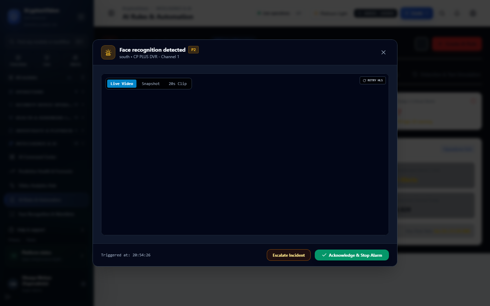

# Sentinel Grid — AI Analytics & Visual Rule Engine Manual

**Product Version:** Sentinel Grid 0.1.0  
**Domain Focus:** NBFC, Gold Loan, Retail Banking & High-Assurance Perimeter Surveillance  
**Document Version:** 1.0.0  
**Last Updated:** September 5, 2026  
**Audience:** Security Directors, Risk & Compliance Officers, SOC Supervisors, AI Surveillance Engineers  

---

## Table of Contents

1. [Introduction to NBFC Visual Surveillance](#1-introduction-to-nbfc-visual-surveillance)
2. [Core Conceptual Architecture](#2-core-conceptual-architecture)
3. [Visual Zone Designer (Polygons & Tripwires)](#3-visual-zone-designer-polygons--tripwires)
4. [Compound Rule Evaluator & Scheduling](#4-compound-rule-evaluator--scheduling)
5. [Anti-Storm Deduplication & Cooldown State Machine](#5-anti-storm-deduplication--cooldown-state-machine)
6. [The 36 NBFC Regulatory & Operational Rule Templates](#6-the-36-nbfc-regulatory--operational-rule-templates)
7. [Step-by-Step Practical Rule Recipes](#7-step-by-step-practical-rule-recipes)
8. [Safe Rule Testing: Shadow Mode & Simulation Lab](#8-safe-rule-testing-shadow-mode--simulation-lab)
9. [Operator Feedback Loop & Precision Tuning](#9-operator-feedback-loop--precision-tuning)
10. [Honest AI Model Registry & Capacity Budgeting](#10-honest-ai-model-registry--capacity-budgeting)

---

## 1. Introduction to NBFC Visual Surveillance

Non-Banking Financial Companies (NBFCs), gold loan institutions, and retail banking branches present unique security challenges:
* **High-Value Assets:** Concentrated gold collateral, cash reserves, and vault operations.
* **Dual-Control Compliance:** Mandatory presence of two authorized officers during strongroom access.
* **Customer Queue & Crowd Pressures:** Flash crowds and aggressive queues at cash/pledge counters.
* **After-Hours Vulnerabilities:** Night-time intrusion, camera blinding, and physical tamper attempts.

Sentinel Grid addresses these requirements through a **Configurable Visual Rule Engine** integrated into the VMS control plane. Administrators can define, test, and activate compound AI rules without modifying source code or redeploying backend containers.

---

## 2. Core Conceptual Architecture

The AI surveillance pipeline functions as a deterministic evaluation chain:

```text
[RTSP Video Stream]
        │
        ▼
 [AI Detectors]  ───► (Objects Detected: Person, Vehicle, Bag, Tamper)
        │
        ▼
[Object Tracker] ───► (Persistent Track IDs across frames)
        │
        ▼
  [Zone Engine]  ───► (Point-in-Polygon & Line-Crossing Tests)
        │
        ▼
 [Rule Evaluator]───► (Compound Boolean: AND / OR / NOT)
        │
        ▼
[Persistence Timer]─► (Has condition persisted for durationMs?)
        │
        ▼
 [Schedule Filter]──► (Is current time in Schedule window? Asia/Kolkata)
        │
        ▼
[Dedupe & Cooldown]─► (Suppress alert storms on ongoing tracks)
        │
        ▼
[Action Dispatcher]─► (Dashboard Alert, Siren, Webhook, Voice Call)
```

### Core Terminology
* **Detector:** The underlying computer vision model processing video frames (e.g., YOLOv8 person detector, background subtraction tamper detector).
* **Zone (`AnalyticsZone`):** A defined geometric area on the camera's field of view. Coordinates are **normalized (`0.0`–`1.0`)**, ensuring zones remain accurate if camera resolution or aspect ratio changes.
* **Track:** A temporally linked sequence of detections identifying the same physical object moving through the scene with a persistent `trackId`.
* **Rule (`AnalyticsRule`):** A declarative specification defining *What*, *Where*, *How Long*, *When*, and *What Action* to execute.
* **Compound Condition:** A boolean expression linking detector outputs (e.g., `PERSON_COUNT > 2 AND CASH_DRAWER == OPEN`).
* **Persistence Duration (`durationMs`):** The amount of continuous time a condition must hold true before the rule fires. Prevents false triggers from brief visual glitches.
* **Schedule:** Timezone-aware operating filter evaluated against Indian Standard Time (`Asia/Kolkata`).
* **Cooldown Window (`cooldownMs`):** A mandatory quiet period after an alert fires, preventing redundant alert storms for the same ongoing incident.
* **Action:** The operational response triggered upon breach (e.g., siren relay, dashboard toast, voice call).

---

## 3. Visual Zone Designer (Polygons & Tripwires)

The Visual Zone Designer (`/analytics/rules`) enables administrators to draw geometric detection areas directly over live camera preview frames:


*Figure 3.1: Visual Zone Designer & Rule Management Workspace (`/analytics/rules`)*

### Supported Zone Types (`AnalyticsZoneType`)
1. **POLYGON (Enclosed Area):**
   * Defined by 3 or more vertices in normalized coordinates `[(x1, y1), (x2, y2), ...]`.
   * Evaluated using the **Ray-Casting Point-in-Polygon (PIP)** algorithm against the bottom-center coordinate of an object's bounding box.
   * *Use Cases:* Vault Interior, Cash Counter Staff Zone, Customer Waiting Lounge, ATM Fascia.
2. **LINE / TRIPWIRE (Directional Crossing):**
   * Defined by a start point `(x1, y1)` and end point `(x2, y2)` with an associated direction vector.
   * Evaluated using vector cross-product tests on consecutive frame track positions.
   * *Use Cases:* Branch Entry Barrier, Teller Window Line, Perimeter Fence.

### Step-by-Step: Drawing a Zone
1. Open **AI Rules & Automation** (`/analytics/rules`) and select the **Zones** tab.
2. Choose your target **Branch** and **Camera**.
3. Click **Draw New Zone**.
4. Select Zone Shape: **Polygon** or **Tripwire**.
5. Select Zone Classification (e.g., `LOCKER`, `CASH_COUNTER`, `CUSTOMER_AREA`, `RESTRICTED_ZONE`).
6. Click on the live camera canvas to place vertices. Double-click or click the initial point to close the polygon.
7. Enter a descriptive name (e.g., *Indiranagar Vault Room Inner Zone*).
8. Click **Save Zone**.

---

## 4. Compound Rule Evaluator & Scheduling

### Compound Boolean Evaluation
Rules support nested boolean conditions to eliminate false positives:

```json
{
  "operator": "AND",
  "conditions": [
    {
      "detector": "PERSON_DETECTOR",
      "metric": "count",
      "operator": ">",
      "threshold": 2
    },
    {
      "detector": "MOTION_DETECTOR",
      "metric": "motion_percentage",
      "operator": ">",
      "threshold": 15
    }
  ]
}
```

### Timezone-Aware Banking Schedules
Banking schedules are evaluated strictly in `Asia/Kolkata` (IST) to ensure seamless synchronization with branch operations:

| Schedule Type | Effective Window (IST) | Days Applicable | Intended Application |
| :--- | :--- | :--- | :--- |
| `BUSINESS_HOURS` | `08:30 – 17:30` | Monday – Saturday | Queue SLA, Customer Density, Staff Presence. |
| `AFTER_HOURS` | `17:30 – 08:30` | Everyday + Full Sundays | Night Intrusion, Loitering, Perimeter Crossing. |
| `BRANCH_OPENING` | `08:00 – 10:00` | Monday – Saturday | Dual-custody arrival verification, guard check-in. |
| `BRANCH_CLOSING` | `17:00 – 19:00` | Monday – Saturday | Safe-lock verification, customer egress check. |
| `24X7` | `00:00 – 23:59` | All 7 Days | Vault Occupancy, Camera Tampering, Recording Gaps. |
| `CUSTOM` | User-defined intervals | Specific days | Specialized weekend vault access or audit windows. |

---

## 5. Anti-Storm Deduplication & Cooldown State Machine

A critical flaw in standard AI surveillance systems is **alert flooding** (e.g., an unauthorized person standing in a vault generating an alert on every single frame, resulting in 1,500 alerts a minute).

Sentinel Grid eliminates this through the **Deduplication State Machine** (`nbfc_rule_state`):

```text
       [Condition Met]
              │
              ▼
   ┌──────────────────────┐
   │ Check Fencing Token  │
   │    & Rule State      │
   └──────────┬───────────┘
              │
     ┌────────┴────────┐
     ▼                 ▼
[First Occurrence]  [Ongoing Alert]
     │                 │
     ▼                 ▼
[Check durationMs]  [Check cooldownMs]
     │                 │
     │                 ├─────────────────────┐
     ▼                 ▼                     ▼
[Fire Alert!]    [In Cooldown Window]  [Cooldown Expired]
  (status: ACTIVE)  (status: COOLDOWN)    (status: ACTIVE)
  (Dispatch actions) (Update track only;  (Fire new alert!)
                     Suppress sirens)
```

* **Fencing Tokens:** Distributed Redis keys guarantee that multiple analytics cluster nodes never evaluate the same frame track concurrently.
* **Cooldown Windows:** Configurable per rule (typically 60s to 300s). During cooldown, evidence clips are updated without re-triggering loud sirens or external phone calls.

---

## 6. The 36 NBFC Regulatory & Operational Rule Templates

Sentinel Grid includes 36 pre-seeded compliance rule templates (`nbfc_rule_templates` table). Administrators can instantiate any template with 1-click:

### Category A: Vault & Strongroom Security
1. `NBFC-R01`: **Vault Over-Occupancy** — Triggers if person count > 2 in strongroom for > 5s (`CRITICAL`).
2. `NBFC-R02`: **Dual-Control Solitary Access** — Triggers if only 1 person enters vault during business hours (`CRITICAL`).
3. `NBFC-R03`: **Vault Door Open Too Long** — Strongroom door open duration > 180s (`HIGH`).
4. `NBFC-R04`: **After-Hours Vault Motion** — Any motion detected in strongroom outside operating hours (`CRITICAL`).
5. `NBFC-R05`: **Unattended Strongroom Open** — Strongroom door unlocked with 0 personnel present (`CRITICAL`).
6. `NBFC-R06`: **Vault Grille Gate Bypass** — Line crossing across inner security grille without key card (`HIGH`).
7. `NBFC-R07`: **Vault Ceiling Tamper** — Displacement or defocus on vault ceiling camera (`CRITICAL`).

### Category B: Cash & Gold Loan Pledge Counters
8. `NBFC-R08`: **Cash Counter Crowd Surge** — Person count in customer area > 5 for > 60s (`MEDIUM`).
9. `NBFC-R09`: **Customer Crossing Teller Line** — Customer reaching over acrylic security barrier (`HIGH`).
10. `NBFC-R10`: **Unattended Cash Counter** — Teller drawer unlocked while teller desk is unoccupied > 120s (`HIGH`).
11. `NBFC-R11`: **Cash Counter Dwell Time Exceeded** — Single customer at counter > 20 minutes (`LOW`).
12. `NBFC-R12`: **Queue SLA Breach** — Customer queue length > 8 people for > 3 minutes (`HIGH`).
13. `NBFC-R13`: **Teller Hall Loitering** — Dwell time in lobby > 15 minutes without transaction (`MEDIUM`).
14. `NBFC-R14`: **Gold Appraisal Dual Verification** — Gold weighing scale area has < 2 staff members (`MEDIUM`).

### Category C: Cash Van & Logistics Security
15. `NBFC-R15`: **Cash Van Arrival Unmonitored** — Cash van bay occupied but armed guard not visible (`HIGH`).
16. `NBFC-R16`: **Cash Transfer Line Crossing** — Unauthorized personnel crossing cash transfer corridor (`CRITICAL`).
17. `NBFC-R17`: **Cash Van Extended Dwell** — Cash van parked in bay > 30 minutes (`LOW`).
18. `NBFC-R18`: **Cash Box Unattended in Bay** — Object left behind in transfer area > 30s (`CRITICAL`).
19. `NBFC-R19`: **Cash Van Armed Guard Missing** — Guard absence during cash movement window (`HIGH`).

### Category D: Branch Opening & Closing Dual Custody
20. `NBFC-R20`: **Single Person Branch Opening** — Only 1 employee present during branch opening window (`HIGH`).
21. `NBFC-R21`: **Delayed Branch Opening** — Zero staff detected inside branch by 09:30 IST (`MEDIUM`).
22. `NBFC-R22`: **Branch Left Unlocked After Hours** — Motion detected in main hall past 20:00 IST (`HIGH`).
23. `NBFC-R23`: **Staff Remaining Overnight** — Continuous person presence past 22:00 IST (`HIGH`).
24. `NBFC-R24`: **Emergency Exit Blockage** — Object left in fire exit corridor > 5 minutes (`MEDIUM`).

### Category E: Surveillance System Integrity & Tamper
25. `NBFC-R25`: **Camera Spray / Blinding** — Rapid illumination drop or occlusion > 5s (`CRITICAL`).
26. `NBFC-R26`: **Camera Displacement / Defocus** — Structural shift in camera background model (`HIGH`).
27. `NBFC-R27`: **Recording Gap Exceeds SLA** — Camera continuous recording gap > 30s (`CRITICAL`).
28. `NBFC-R28`: **Storage Retention Risk** — Storage volume free space < 15% (`HIGH`).
29. `NBFC-R29`: **Camera Clock Drift** — Device clock diverges from server by > 1000ms (`MEDIUM`).
30. `NBFC-R30`: **Edge Gateway Offline** — Branch gateway heartbeat missing > 60s (`CRITICAL`).

### Category F: ATM & External Perimeter
31. `NBFC-R31`: **ATM Vestibule Multi-Person Entry** — Person count > 1 inside single-ATM cubicle (`MEDIUM`).
32. `NBFC-R32`: **ATM Loitering Past Midnight** — Dwell time > 10 minutes in ATM room between 00:00–05:00 (`HIGH`).
33. `NBFC-R33`: **ATM Fascia Tampering** — Object placed over card reader slot (`CRITICAL`).
34. `NBFC-R34`: **Branch Shutter Tampering** — Vibration or movement on entrance shutter after hours (`CRITICAL`).
35. `NBFC-R35`: **Roof / Skylight Intrusion** — Motion on branch terrace / roof perimeter (`CRITICAL`).
36. `NBFC-R36`: **Server Rack Door Left Open** — IT communications cabinet open > 10 minutes (`HIGH`).

---

## 7. Step-by-Step Practical Rule Recipes

### Recipe 1: Strongroom Dual-Control Enforcement
* **Scenario:** NBFC guidelines mandate that no individual may enter the gold locker alone.
* **Step 1:** In **Zones**, draw polygon `ZONE_VAULT_INTERIOR` enclosing the strongroom.
* **Step 2:** Click **Create Rule**.
* **Step 3:** Set Name: `Vault Solitary Access Alarm`.
* **Step 4:** Select Zone: `ZONE_VAULT_INTERIOR`.
* **Step 5:** Detector: `PERSON_DETECTOR`. Operator: `==`. Threshold: `1`.
* **Step 6:** Persistence Duration: `3000 ms` (3 seconds).
* **Step 7:** Schedule: `BUSINESS_HOURS`.
* **Step 8:** Severity: `CRITICAL`.
* **Step 9:** Actions: Check `Dispatch Dashboard Alert`, `Trigger Siren`, and `Send SMS to Regional Head`.
* **Step 10:** Click **Save & Activate**.

### Recipe 2: Cash Counter Queue Surge Management
* **Scenario:** Manage branch congestion during peak gold release hours.
* **Step 1:** Draw polygon `ZONE_TELLER_QUEUE` over the customer waiting line.
* **Step 2:** Condition: `QUEUE_DETECTOR`, `count > 8`.
* **Step 3:** Duration: `180000 ms` (3 minutes).
* **Step 4:** Schedule: `BUSINESS_HOURS`. Severity: `HIGH`.
* **Step 5:** Action: `Dispatch Dashboard Alert` to Branch Operations Manager to open additional counters.

---

## 8. Safe Rule Testing: Shadow Mode & Simulation Lab

Deploying unverified AI rules directly into production can cause panic from false siren activations. Sentinel Grid provides two safety testing environments:

### Shadow Mode (Real-Time Silent Evaluation)
* Set `ruleExecutionState: "SHADOW"`.
* The rule runs in real-time against live camera feeds.
* When conditions are met, the engine records trigger timestamps, bounding boxes, and evaluation metrics in `nbfc_rule_test_results`.
* **No sirens sound, no SMS messages are sent, and no alerts flood the operator console.**
* Administrators can inspect shadow triggers over 48 hours to confirm zero false alarms before clicking **Promote to Active**.

### Historical Simulation Lab
* Select any historical recording interval (e.g., yesterday between 14:00 and 16:00).
* Click **Run Simulation Test**.
* The engine replays recorded video frames through the proposed rule configuration and outputs a detailed performance report:
  * Total Frames Evaluated
  * Trigger Count
  * False Positive Rate Estimation
  * Compute Latency Impact

---

## 9. Operator Feedback Loop & Precision Tuning

Operators can submit feedback on any triggered alert by clicking **Report False Positive** (`/operations/alerts`):

* **Feedback Metrics Logged (`nbfc_rule_feedback`):**
  * `alertId`, `ruleId`, `operatorId`
  * `feedbackType`: `FALSE_POSITIVE`, `MISCLASSIFICATION`, `ZONE_SPILLOVER`, `TRUE_POSITIVE`
  * `operatorNotes`: (e.g., *Customer umbrella misclassified as second person*).
* **Automated Threshold Recommendations:**
  * When a rule accumulates more than 5 false positive reports in 7 days, the AI Quality Center (`/admin/ai-quality`) suggests optimal threshold and duration adjustments to restore high precision.

---

## 10. Honest AI Model Registry & Capacity Budgeting

Sentinel Grid enforces strict truthfulness regarding AI detector readiness. Never fabricate confidence scores or claim unsupported models are production-ready:

| Model / Detector | Internal Identifier | Certification Status | GPU Memory Requirement | Max Streams / CPU Core |
| :--- | :--- | :---: | :---: | :---: |
| **YOLOv8 Person Detector** | `model.person.yolov8m` | **PRODUCTION_READY** | 1.8 GB VRAM | 4 Channels @ 5 FPS |
| **Zone Incursion & Tripwire** | `model.zone.spatial_v2` | **PRODUCTION_READY** | 200 MB RAM | 16 Channels @ 15 FPS |
| **Queue & Density Estimator** | `model.queue.density_v1` | **PRODUCTION_READY** | 800 MB RAM | 8 Channels @ 5 FPS |
| **Camera Tamper / Displacement** | `model.tamper.optical_v1`| **PILOT_READY** | 150 MB RAM | 16 Channels @ 2 FPS |
| **Vehicle ANPR (Indian Plates)**| `model.anpr.lpr_net_v2` | **PILOT_READY** | 1.2 GB VRAM | 2 Channels @ 10 FPS |
| **ATM Fascia Overlay Detector** | `model.atm.skimmer_v1` | **PILOT_READY** | 600 MB RAM | 4 Channels @ 2 FPS |
| **1:N Face Identification** | `model.face.arcface_r100` | **EXPERIMENTAL** | 3.5 GB VRAM | Prototype / Gated |
| **Fall / Medical Distress** | `model.behavior.fall_v1` | **NOT_IMPLEMENTED** | N/A | **0 (Feature Stub)** |

> [!NOTE]
> Detectors marked `EXPERIMENTAL` or `NOT_IMPLEMENTED` are strictly gated in the capability registry. They cannot be assigned to production alerting rules.
