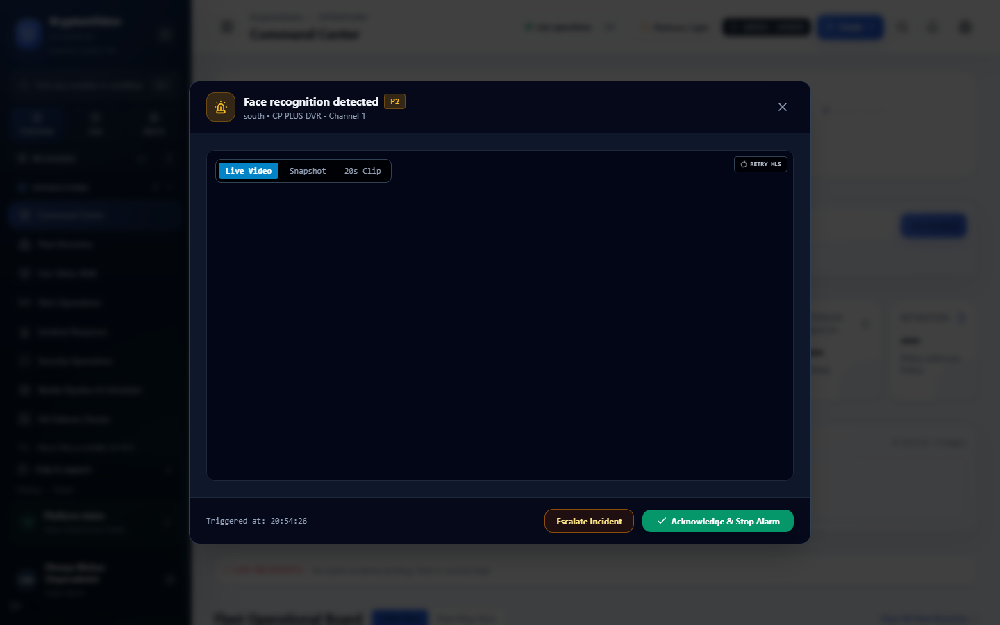
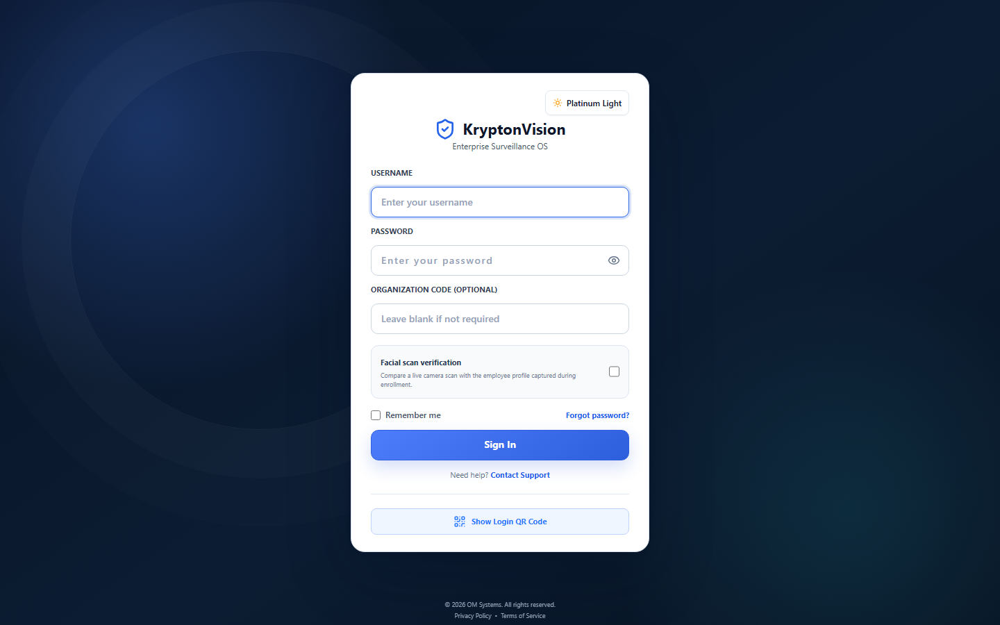
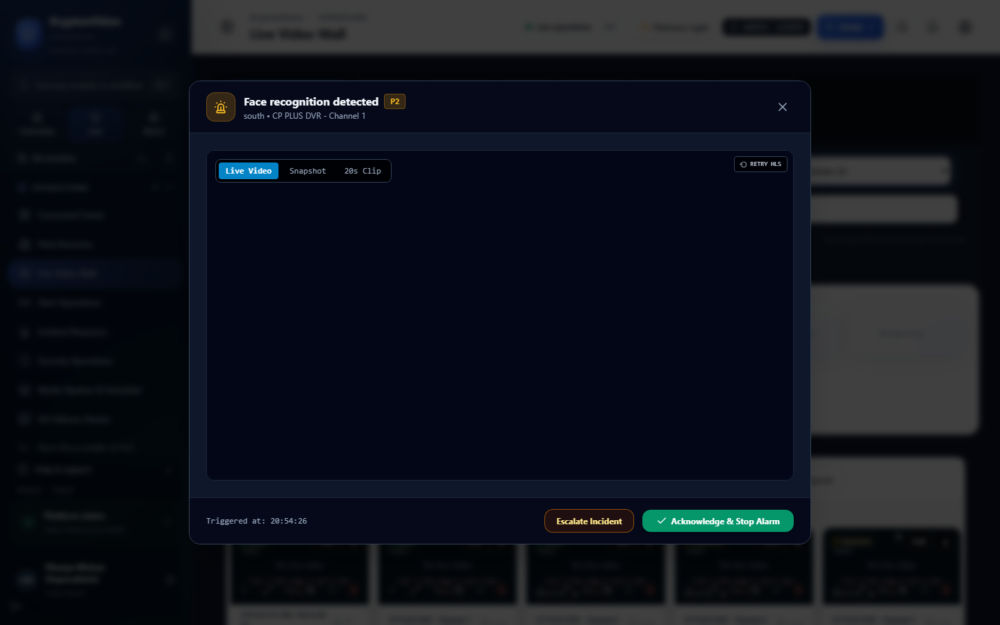
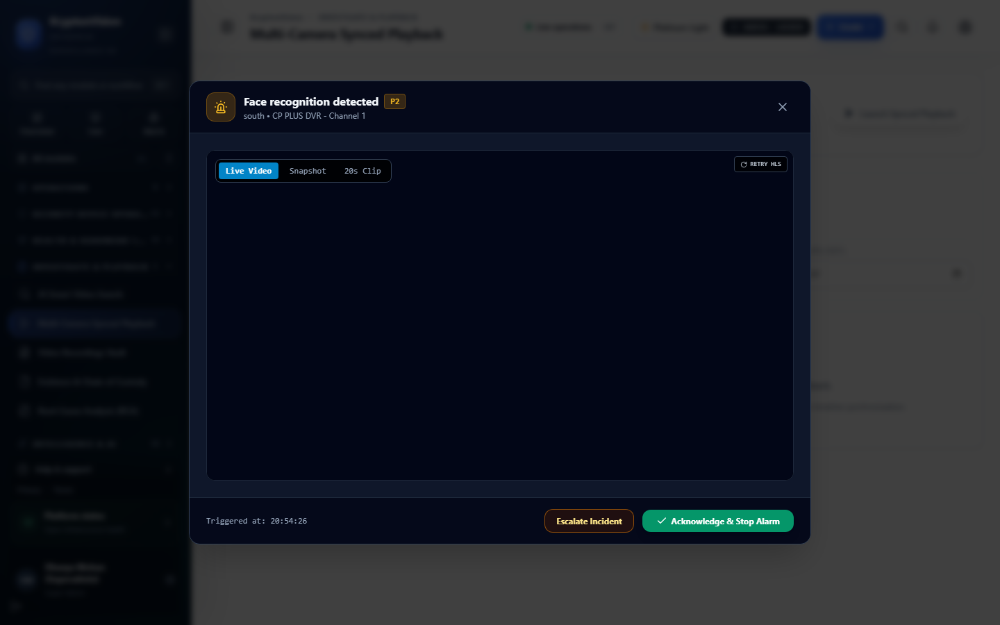
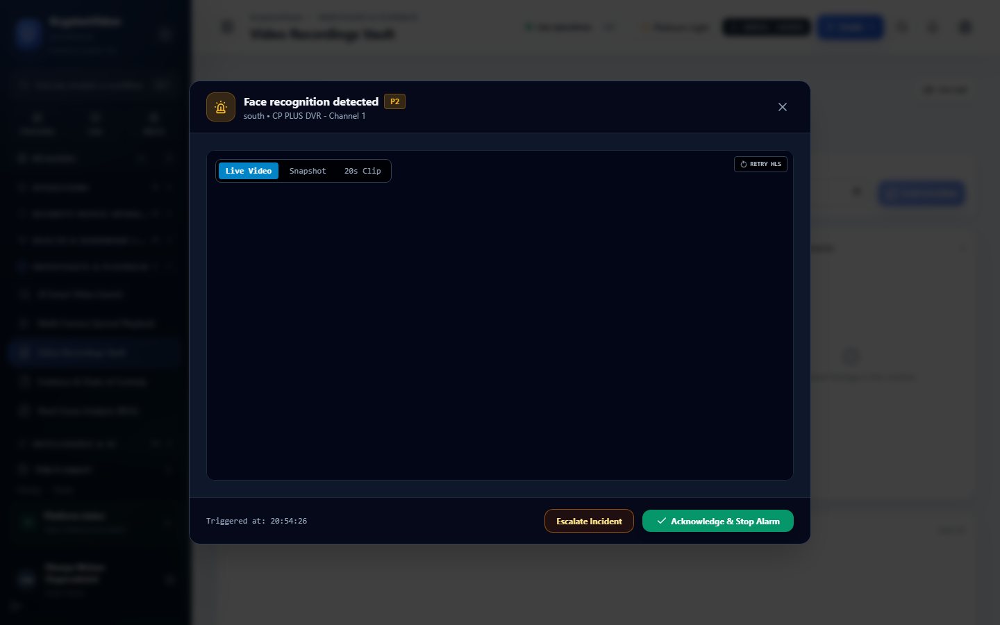
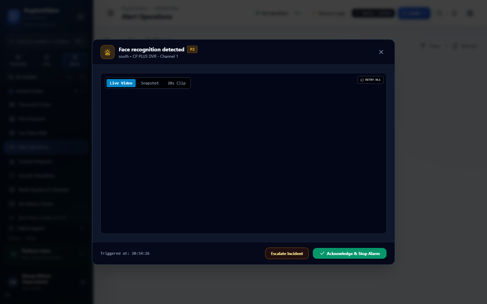
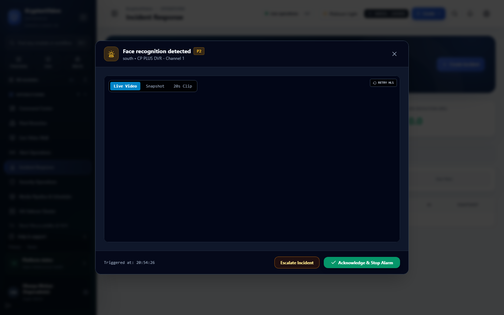
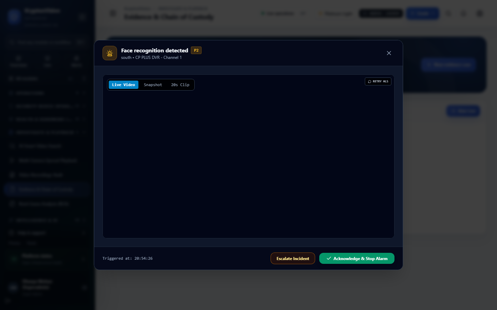
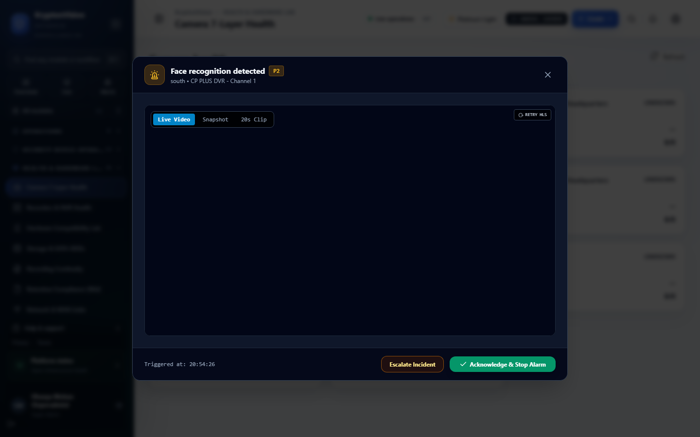

# Sentinel Grid — Operator User Manual

**Product Version:** Sentinel Grid 0.1.0  
**Dashboard Version:** @sentinel/dashboard 0.1.0  
**Document Version:** 1.0.0  
**Last Updated:** September 5, 2026  
**Audience:** SOC Operators, Branch Security Officers, Regional Monitoring Personnel, Field Security Staff  

---

## Table of Contents

1. [Introduction & Operational Role](#1-introduction--operational-role)
2. [User Interface & Navigation Overview](#2-user-interface--navigation-overview)
3. [Login, Sessions & Security Verification](#3-login-sessions--security-verification)
4. [Command Center & Operational Dashboards](#4-command-center--operational-dashboards)
5. [Live View & Video Wall Operations](#5-live-view--video-wall-operations)
6. [Playback & Recording Investigation](#6-playback--recording-investigation)
7. [Alert Management & Deduplication](#7-alert-management--deduplication)
8. [Incident Response & Playbook Workflows](#8-incident-response--playbook-workflows)
9. [Forensic Evidence & Chain of Custody](#9-forensic-evidence--chain-of-custody)
10. [AI Analytics & Visual Rules Monitoring](#10-ai-analytics--visual-rules-monitoring)
11. [Device Health & Hardware Diagnostics](#11-device-health--hardware-diagnostics)
12. [Screenshot Map & UI Reference](#12-screenshot-map--ui-reference)

---

## 1. Introduction & Operational Role

Sentinel Grid is an enterprise-grade, high-assurance Video Management System (VMS) and AI surveillance orchestration platform purpose-built for financial institutions, Non-Banking Financial Companies (NBFCs), gold loan branches, and distributed enterprise premises.

As a **Sentinel Grid Operator**, your primary responsibilities include:
* Maintaining 24x7 situational awareness across branch cameras, banking halls, cash counters, and vault perimeters.
* Triaging real-time AI detections, security alerts, and system health warnings.
* Escalating verified security breaches into actionable Incidents using Standard Operating Procedures (SOPs).
* Exporting cryptographically sealed forensic evidence packages for internal audit and law enforcement.
* Monitoring camera streams and physical security equipment to prevent recording blindspots.

> [!NOTE]
> All actions in Sentinel Grid—including stream viewing, alert triage, incident updates, and evidence exports—are cryptographically chained and recorded in an immutable audit ledger (`SHA-256` / `Ed25519`). Operators must adhere strictly to organizational access policies.

---

## 2. User Interface & Navigation Overview

The Sentinel Grid dashboard provides a unified navigation sidebar organized into logical operational sections:

* **OPERATIONS**: Command Center (`/`), Fleet Branches (`/operations/branches`), Live Video Wall (`/control-room`), Alert Operations (`/operations/alerts`), Incident Response (`/incidents`), Security Operations (`/security-operations`).
* **SECURITY DEVICE OPERATIONS**: Integrated CCTV, access control doors, intrusion sensors, panic buttons, fire panels, vault/safe alarms, ATM fascia monitoring (`/security-devices`).
* **HEALTH & HARDWARE LAB**: 7-Layer camera health (`/operations/cameras`), NVR/DVR status (`/maintenance/dvr-nvr-monitor`), storage drives (`/operations/storage`), recording continuity (`/operations/recording`), 90-day retention compliance (`/compliance/recording`), network latency (`/operations/network`), UPS power telemetry (`/operations/ups`).
* **INVESTIGATE & PLAYBACK**: Multi-camera synced playback (`/playback/synced`), recordings vault (`/recordings`), evidence chain of custody (`/evidence`), smart video search (`/video-search`), root-cause analysis (`/operations/rca-analysis`).
* **INTELLIGENCE & AI**: AI command center (`/operations/ai-command-center`), AI rules & automation (`/analytics/rules`), people counting & heatmaps (`/analytics/people`), banking cash counter analytics (`/analytics/banking`), ANPR vehicle telemetry (`/analytics/anpr`), face watchlists (`/analytics/face-recognition`).

*Figure 2.1: Command Center Overview (`/`)*

---

## 3. Login, Sessions & Security Verification

### Purpose
Accessing the Sentinel Grid console securely while establishing operator identity and session scoping.

### Who Can Use It
All authorized operators, investigators, branch supervisors, and administrators.

### Prerequisites
* Assigned username and password provided by the System Administrator.
* Valid organizational tenant code (optional if logging into a single-tenant deployment).
* Webcam enabled if the organization enforces facial verification on login.

### Login Steps

*Figure 3.1: Sentinel Grid Operator Sign-In (`/login`)*

1. Navigate to the Sentinel Grid URL (e.g., `https://<server-domain-or-ip>/login`).
2. Enter your **Username** in the username field.
3. Enter your **Password**. Click the eye icon to verify input if needed.
4. *(Optional)* Enter your **Organization Code** if provided by IT.
5. *(If Facial Verification is Enabled)*:
   * Click **Scan Face**.
   * Position your face within the camera viewfinder box.
   * Click **Capture Scan** once aligned.
6. Click **Sign In**.

### Session Lifespan & Expiry
* **Idle Timeout:** Sessions automatically invalidate after 30 minutes of inactivity.
* **Token Refresh:** Sessions are backed by secure HTTP-only cookies and JWT refresh mechanisms.
* **Concurrent Logins:** If another user signs in with your credentials, the prior session will terminate immediately with a notification: `Your session has expired. Please sign in again.`

### Password Requirements & Mandatory First-Time Change
* Minimum length: **8 characters**.
* Must contain uppercase, lowercase, numbers, and special characters.
* If your account is flagged with `mustChangePassword`, the system immediately displays the Password Reset form. You must enter and confirm a new password before accessing live feeds.

### Single Sign-On (SSO) & MFA Status
* **Local Authentication:** **Production Ready**.
* **Facial Verification (Camera Capture):** **Production Ready**.
* **SAML 2.0 / OpenID Connect (Azure AD / Okta):** **Configuration Required** (Supported by the backend identity provider, requires enterprise IdP setup by the Administrator).
* **MFA / Biometric Challenge:** **Partially Implemented** (Enforced through Zero-Trust context policies and security posture compliance tracking).

---

## 4. Command Center & Operational Dashboards

The Command Center (`/`) provides an instant real-time pulse of your monitoring domain:

| Widget / Card | What It Means | Calculation Method | Operator Action |
| :--- | :--- | :--- | :--- |
| **Branch Health** | Overall operational readiness of branches under your watch. | Aggregated score based on online cameras, edge agents, and recording status. | If any branch drops below 90%, open Fleet Branches (`/operations/branches`) to investigate. |
| **Camera 7-Layer Health** | Physical, network, and stream health of surveillance cameras. | Probes: Ping, RTSP connection, video decodability, frame-rate, bit-rate, image quality, and clock drift. | If status indicates `OFFLINE` or `DEGRADED`, verify power, network switch, and notify maintenance. |
| **Active Alerts** | Unacknowledged alarms requiring immediate attention. | Real-time stream of AI triggers, tamper alerts, and hardware alarms within the active time window. | Click on the alert banner to review the live clip, acknowledge, and create an incident if verified. |
| **Critical Incidents** | Open investigations currently under active handling. | Count of open incident records flagged with `CRITICAL` or `HIGH` severity. | Prioritize critical incident checklists and dispatch guards according to branch SOP. |
| **Recording Status** | Continuity of continuous and event video recording. | Percentage of active camera streams successfully writing segmented chunks to disk. | If recording drops below 100%, check Storage Telemetry (`/operations/storage`). |
| **Storage Capacity** | Remaining retention space across hot storage tiers. | Real-time filesystem metric (`statvfs`) or elastic S3 tier capacity. | If disk utilization exceeds **85%**, alert the administrator to review pruning policies. |
| **AI Alerts** | Detections produced by automated neural networks. | Feed of rule evaluations (intrusion, loitering, crowd, queue, tamper). | Validate detections against false positives; mark feedback if inaccurate. |
| **Network & WAN Status** | Latency and packet drop rate between edge gateways and core. | Round-trip ping and jitter measurements collected by edge agents. | If latency exceeds **250ms**, expect stream degradation or buffering. |

---

## 5. Live View & Video Wall Operations

### Purpose
Real-time monitoring of live camera feeds across multiple grid layouts with low-latency streaming and PTZ controls.

*Figure 5.1: Live Video Wall & Control Room (`/control-room`)*

### Key Features
1. **Camera Grid Selection:**
   * Choose between layout modes: **1x1** (single focused feed), **2x2** (4 cameras), **3x3** (9 cameras), **4x4** (16 cameras), and asymmetric layouts (**1+5** or **1+7**).
2. **Stream Switching (Main vs. Sub Stream):**
   * High-definition **Main Stream** is selected by default for 1x1 full-screen viewing.
   * Low-bandwidth **Sub Stream** is automatically used in 3x3 and 4x4 grids to preserve network bandwidth and CPU decode capacity.
3. **Camera Status Badges:**
   * `ONLINE`: Video feed is active, decodable, and streaming at expected framerate (green indicator).
   * `OFFLINE`: Camera is unreachable; no RTSP or network signal detected (red indicator).
   * `DEGRADED`: Stream is experiencing frame drops, high jitter, or packet loss (yellow indicator).
   * `RECONNECTING`: Gateway is attempting an automatic reconnect cycle (amber indicator).
   * `UNKNOWN`: Device state is unverified or awaiting telemetry handshake (gray indicator).
4. **PTZ Controls (Pan, Tilt, Zoom):**
   * Available for cameras with ONVIF PTZ support (`video.ptz_control`).
   * Use the directional pad to pan and tilt. Use the zoom slider or mouse wheel to zoom in/out.
   * Preset Positions: Select pre-configured patrol presets (e.g., *Preset 1: Vault Door*, *Preset 2: Cash Counter*).
5. **Snapshot Capture:**
   * Click the **Camera Icon** on any active video tile to capture an instant high-resolution PNG snapshot. The snapshot is saved to your local downloads and automatically cataloged in the temporary evidence drawer.
6. **Two-Way Audio (Listen / Talkback):**
   * Status: **Beta / Protocol Dependent** (`video.audio_twoway`). Supported on cameras with WebRTC or SIP backchannel capabilities. Click the **Microphone Icon** to transmit voice; click the **Speaker Icon** to monitor ambient audio.

> [!WARNING]
> PTZ controls lock the camera position for all concurrent viewers. Return cameras to their designated **Home Preset** immediately after completing visual verification.

---

## 6. Playback & Recording Investigation

### Purpose
Reviewing recorded historical footage, verifying recording continuity, and inspecting multi-angle footage across incident timelines.

*Figure 6.1: Multi-Camera Synchronized Playback (`/playback/synced`)*

### Playback Controls
* **Camera Selection:** Select up to 4 cameras simultaneously from the branch tree for synchronized playback.
* **Timeline Bar:** Color-coded timeline reflecting recorded media:
  * **Solid Blue/Green:** Continuous 24x7 recording available.
  * **Yellow Marks:** Motion-triggered detection intervals.
  * **Red Marks:** Critical AI Rule or Sensor Alarm trigger events.
  * **Gray / Empty:** No recording data present.
* **Seek & Shuttle:** Click anywhere on the timeline to scrub to an exact timestamp. Use playback speed buttons: **0.5x, 1x, 2x, 4x, 8x, 16x**.
* **Synchronized Scrubbing:** When enabled, scrubbing the timeline moves all active camera tiles to the exact same millisecond.

### Distinguishing Recording Gaps vs. Failures

| Symptom | Cause | Meaning | Operator Action |
| :--- | :--- | :--- | :--- |
| **No Recording (Solid Gray)** | Policy / Schedule | Camera is configured for motion-only recording, or recording was intentionally disabled. | Check recording policy in camera settings. |
| **Recording Gap (Broken Bar)** | Network/Power Interruption | Camera dropped offline or storage write failed during that window. | Check Camera Health audit to correlate with link downtime. |
| **Camera Offline Notice** | Hardware / Link Fault | The physical camera lost power or network connectivity. | Contact branch facilities team or IT support. |
| **Storage Unavailable Notice** | Volume Mount Error | Storage tier unmounted or read-only disk failure. | Notify System Administrator immediately. |

*Figure 6.2: Historical Recordings Vault (`/recordings`)*

---

## 7. Alert Management & Deduplication

### Purpose
Triage incoming alarms generated by AI detectors, tamper sensors, and hardware watchdogs without experiencing alert fatigue.

*Figure 7.1: Real-Time Alert Operations Workspace (`/operations/alerts`)*

### Alert Severity Hierarchy
* **CRITICAL**: Immediate physical threat or severe regulatory violation (e.g., Vault after-hours intrusion, dual-control violation in gold locker, camera blinded/tampered). Response time target: **< 60 seconds**.
* **HIGH**: Operational breach requiring swift intervention (e.g., Cash counter queue overflow > 8 people, loitering outside branch after closing). Response time target: **< 5 minutes**.
* **MEDIUM**: Procedural anomalies (e.g., Unattended object in customer lounge, unauthorized vehicle in cash van bay). Response time target: **< 15 minutes**.
* **LOW**: Non-urgent telemetry warnings (e.g., Minor camera clock drift, ambient noise threshold). Response time target: **< 1 hour**.
* **INFO**: Informational milestones (e.g., Scheduled branch opening, scheduled shift change).

### Operator Alert Triage Workflow
1. **Select Alert:** Click the incoming alert row in `/operations/alerts`.
2. **Review Evidence:** Inspect the 5-second pre-event and post-event video clip, object bounding boxes, and triggered zone coordinates.
3. **Acknowledge:** Click **Acknowledge Alert**. This assigns the alert to your username and stops audio escalation chimes.
4. **Take Action:**
   * **Create Incident:** If the breach is verified, click **Promote to Incident** to launch the formal response playbook.
   * **Mark False Positive:** If the alert was triggered by reflections, insects, or normal staff activity, click **Report False Positive** and enter an explanatory note. This sends telemetry to the AI Quality engine to improve detector precision.
   * **Resolve Alert:** If the situation is resolved or required no escalation, click **Resolve** with closing notes.

### Anti-Storm Deduplication & Cooldown State Machine
To prevent frame-by-frame alert flooding (e.g., a person loitering for 10 minutes generating 600 alerts), Sentinel Grid enforces an automated **Cooldown Window** (typically 60–300 seconds). Once a rule triggers:
* The initial alert is dispatched immediately.
* Subsequent detections within the cooldown period update the existing alert track rather than creating new sirens.

---

## 8. Incident Response & Playbook Workflows

### Purpose
Managing formal security incidents from detection through investigation, guard dispatch, and regulatory closure.

*Figure 8.1: Incident Management Center (`/incidents`)*

### Step-by-Step Incident Lifecycle
1. **Creation:** Automatically promoted from an Alert or manually created via **New Incident** (`/incidents/create`).
2. **Assignment:** Assigned to a specific SOC operator or branch security officer.
3. **Playbook Execution:** Follow the integrated SOP checklist displayed in the incident drawer:
   * [ ] Verify camera feed and visual confirmation of threat.
   * [ ] Notify Branch Manager and local security guard.
   * [ ] Activate remote deterrent (siren / audio broadcast if equipped).
   * [ ] Contact local law enforcement / emergency services if unauthorized entry confirmed.
   * [ ] Lock incident evidence and initiate Legal Hold.
4. **Notes & Timeline:** Log every action taken, phone calls placed, and police dispatch numbers in the incident timeline.
5. **Closure:** Once resolved, submit a Root Cause summary and mark the incident **Closed**. Closed incidents cannot be modified without supervisor authorization.

---

## 9. Forensic Evidence & Chain of Custody

### Purpose
Extracting, securing, and exporting tamper-evident video footage for legal proceedings, police submissions, and internal compliance audits.

*Figure 9.1: Forensic Evidence Vault & Chain of Custody (`/evidence`)*

### Forensic Package Guarantees
* **Cryptographic Hashing:** Every video clip and snapshot is sealed with a `SHA-256` checksum upon capture.
* **Digital Signatures:** Packages include an `Ed25519` digital signature (`manifest.sig`) signed by the Sentinel Grid evidence authority.
* **Recorder Provenance:** Telemetry logs include camera serial number, recorder channel, firmware version, and device clock offset.
* **Append-Only Custody Ledger:** Every view, download, export, and unlock is recorded in an immutable Merkle-hash chain (`eventHash = SHA256(eventData + previousHash)`).

### Exporting Court-Admissible Evidence
1. Navigate to **Evidence Vault** (`/evidence`).
2. Select the incident or camera recording interval.
3. Click **Export Forensic Package**.
4. Choose export format:
   * **ZIP Package (Recommended):** Contains the raw MP4 media, metadata manifest (`manifest.json`), cryptographic signature (`manifest.sig`), and a standalone HTML5 verification player.
5. Provide a mandatory **Justification / Case Number** (e.g., *FIR-2026-90412*).
6. Click **Generate & Download**.

### Legal Hold Protection
When an incident is marked with **Legal Hold**, Sentinel Grid locks the underlying video segments. Automated retention pruning policies are strictly overridden, preventing the footage from being overwritten until an authorized supervisor releases the hold.

> [!SECURITY]
> Exported evidence files contain sensitive banking premises footage. Operators are legally responsible for safeguarding downloaded media in accordance with banking privacy standards.

---

## 10. AI Analytics & Visual Rules Monitoring

Sentinel Grid incorporates dedicated computer vision detectors designed for NBFC surveillance:

*Figure 10.1: AI Rules & Automation Workspace (`/analytics/rules`)*

### Supported AI Detectors & Operational Maturity

| Detector | Maturity | Real-World Application | Known Operating Constraints |
| :--- | :---: | :--- | :--- |
| **Person Detection & Intrusion** | **PRODUCTION** | Vault perimeter, after-hours branch entry, restricted zones. | Requires minimum 30 pixels across person height. |
| **Line Crossing (Tripwire)** | **PRODUCTION** | Customer queue boundaries, teller counter barrier, perimeter fence. | Directional arrows (A->B or B->A) must be configured in zone setup. |
| **Crowd Density** | **PRODUCTION** | Customer lobby, cash counter crowding, branch entrance congestion. | High-angle ceiling camera recommended to minimize occlusion. |
| **Loitering Detection** | **PRODUCTION** | Dwell-time monitoring in ATM vestibules or near vault entrances. | Thresholds typically set to 60–180 seconds. |
| **Camera Tampering / Obstruction** | **BETA** | Detects camera lens spraying, defocusing, displacement, or cloth covering. | Triggers within 5 seconds of sustained image occlusion. |
| **ANPR (License Plates)** | **BETA** | Cash van bay vehicle tracking, parking access control. | Vehicle speed must not exceed 25 km/h; requires IR illumination at night. |
| **Face Recognition** | **EXPERIMENTAL** | VIP greeting, known fraudster watchlist alerts. | **Prototype only.** Gated behind experimental flags. Not for legal enforcement. |

---

## 11. Device Health & Hardware Diagnostics

### Purpose
Continuously inspecting physical cameras, edge gateways, storage arrays, and network links to prevent system failure.

*Figure 11.1: Camera 7-Layer Health Monitoring (`/operations/cameras`)*

### Common Hardware Telemetry Symptoms & Actions

| Symptom / Alarm | Root Cause | Operator Verification Step | Recommended Action |
| :--- | :--- | :--- | :--- |
| **Camera Link Down** | Power or cable disconnect | Check PoE switch port status on Network view (`/operations/network`). | Dispatch branch technician to inspect cable and PoE injector. |
| **Clock Drift > 1.0s** | NTP sync failure on camera | Inspect Clock Monitoring card (`/operations/cameras`). | Perform clock resync from Device Configuration center. |
| **Storage Disk Pressure** | Retention volume nearing 90% | Open Storage Operations (`/operations/storage`). | Alert administrator to initiate cold storage tiering or grooming. |
| **Edge Gateway Offline** | Branch power outage / UPS drain | Check UPS Telemetry (`/operations/ups`). | Contact branch manager to verify mains power restoration. |
| **Stream Bitrate Drop** | Network congestion or bad cable | Check stream metrics in `/operations/cameras`. | Toggle camera to sub-stream; notify network operations. |

---

## 12. Screenshot Map & UI Reference

The following table catalogs all primary operator screens captured from the live environment:

| ID | Page Name | Route | Captured File | Description |
| :--- | :--- | :--- | :--- | :--- |
| **SS-001** | Login Page | `/login` | `screenshots/SS-001-login.png` | Operator authentication with optional face verification. |
| **SS-002** | Command Center | `/` | `screenshots/SS-002-command-center.png` | Fleet-wide overview of branch, camera, and alert health. |
| **SS-003** | Live Video Wall | `/control-room` | `screenshots/SS-003-live-video-wall.png` | Multi-grid real-time surveillance feeds and PTZ controls. |
| **SS-004** | Synced Playback | `/playback/synced` | `screenshots/SS-004-synced-playback.png` | Multi-camera synchronized historical footage timeline. |
| **SS-005** | Recordings Vault | `/recordings` | `screenshots/SS-005-recordings-vault.png` | Segmented video archive browser and continuity verification. |
| **SS-006** | Alert Operations | `/operations/alerts` | `screenshots/SS-006-alert-operations.png` | Real-time alarm triage, acknowledgement, and escalation. |
| **SS-007** | Incident Response | `/incidents` | `screenshots/SS-007-incident-response.png` | Incident workspace with SOP checklists and case logs. |
| **SS-008** | Evidence Vault | `/evidence` | `screenshots/SS-008-evidence-vault.png` | Forensic package exports, legal holds, and custody chain. |
| **SS-009** | AI Command Center | `/operations/ai-command-center` | `screenshots/SS-009-ai-command-center.png` | Real-time AI detection metrics and fleet analytics. |
| **SS-010** | AI Rules & Automation | `/analytics/rules` | `screenshots/SS-010-ai-rules-automation.png` | Visual rule engine, zone designer, and 36 NBFC templates. |
| **SS-011** | Camera Health | `/operations/cameras` | `screenshots/SS-011-camera-health.png` | 7-layer diagnostic telemetry for all connected cameras. |
| **SS-012** | Storage Management | `/operations/storage` | `screenshots/SS-012-storage-management.png` | Hard drive capacity, tiering, and retention health. |
