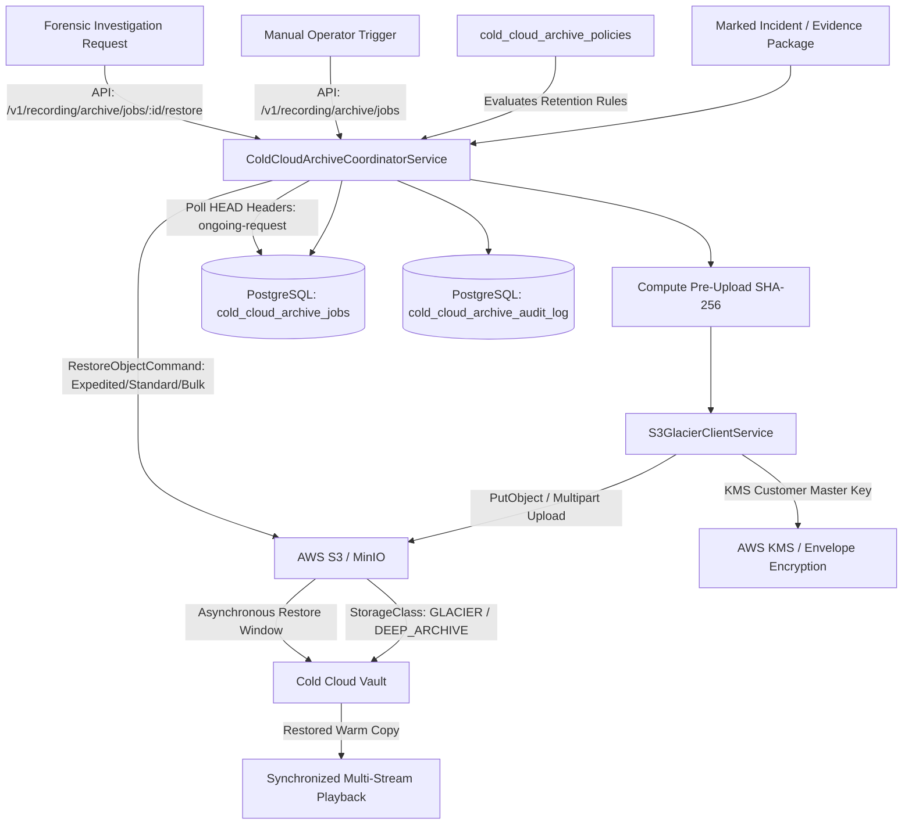

# Cold Cloud Archive Export Architecture

**Capability ID:** `recording.archive`  
**Maturity:** `PRODUCTION`  
**Owner:** `storage-team`  
**Dependencies:** `control-plane`, `s3-compatible-storage`, `postgres`, `kms`

---

## 1. Overview & Operational Context

In enterprise and financial physical security environments (e.g. banking branches, ATMs, currency vaults, and critical infrastructure), regulations require long-term forensic video retention (typically 7 to 10 years). Storing continuous petabyte-scale video on high-performance local disk, NAS, or hot S3 object storage incurs prohibitive operational expenses ($0.023/GB/month vs $0.00099/GB/month in Glacier Deep Archive — an 83% to 95% cost reduction).

The **Cold Cloud Archive Export (`recording.archive`)** system delivers:
1. **Automated Incident Video Archival:** Rules-based and policy-driven sweeps that detect marked incident videos, clips, and evidence packages, and automatically package and transition them to AWS S3 and Glacier cold storage tiers (`GLACIER`, `DEEP_ARCHIVE`, `GLACIER_IR`).
2. **Cryptographic Integrity & Chain of Custody:** Pre-upload calculation of SHA-256 hashes, S3 ETag verification, and immutable recording of all export, restore, and transfer events into `cold_cloud_archive_audit_log`.
3. **Enterprise Compliance & Security:** Server-Side Encryption with AWS Key Management Service (SSE-KMS) or AES256, alongside S3 Object Lock compatibility for tamper prevention (WORM compliance).
4. **Glacier Retrieval Lifecycle:** Multi-tier async restoration orchestration:
   - **Expedited (1–5 Minutes):** Rapid forensic access for urgent police or regulatory court summonses.
   - **Standard (3–5 Hours for Glacier, 12 Hours for Deep Archive):** Routine investigative review.
   - **Bulk (5–12 Hours for Glacier, 48 Hours for Deep Archive):** Scheduled compliance batch exports at minimal retrieval cost.
5. **Real-Time Operational Telemetry & Cost Optimization:** Live tracking of archived gigabytes, active retrieval jobs, and realized cost savings.

---

## 2. Component Architecture



---

## 3. Storage Tier Economics

| Storage Class | Latency to First Byte | Min Storage Duration | Typical Use Case | Cost per GB/mo (Approx) |
|---|---|---|---|---|
| **S3 Standard (Hot)** | Milliseconds | None | Active live viewing & recent 30-day loop | ~$0.0230 |
| **S3 Glacier Instant Retrieval (GLACIER_IR)** | Milliseconds | 90 Days | High-priority incidents with rare but immediate playback needs | ~$0.0040 |
| **S3 Glacier Flexible Archive (GLACIER)** | 1-5 mins (Expedited) / 3-5 hrs (Standard) | 90 Days | Standard marked incident video, regulatory holds | ~$0.0036 |
| **S3 Glacier Deep Archive (DEEP_ARCHIVE)** | 12-48 Hours | 180 Days | 7-10 Year statutory banking compliance archives | ~$0.00099 |

---

## 4. REST API Reference

All endpoints are scoped by tenant ID (extracted from authenticated session or `X-Tenant-ID` header).

### 4.1 List Export Jobs
- **`GET /v1/recording/archive/jobs`**
- **Query Parameters:** `incidentId`, `cameraId`, `branchId`, `status`, `restoreStatus`, `limit`, `offset`
- **Response:**
  ```json
  {
    "data": [
      {
        "id": "8fa21360-6dd8-48f8-b648-283184e9eb0a",
        "incidentId": "d1607519-c299-4aa8-9f37-12bfa407a1aa",
        "incidentNumber": "INC-2026-0812",
        "cameraId": "cam-vault-01",
        "storageTier": "GLACIER",
        "s3Bucket": "sentinel-cold-archive",
        "s3Key": "tenant-01/incidents/INC-2026-0812/cam-vault-01_1726123456.mp4",
        "fileSizeBytes": 45281920,
        "checksumSha256": "4b227777d4dd1fc61c6f884f48641d02b4d121d3fd328cb08b5531fcacdabf8a",
        "archiveStatus": "ARCHIVED",
        "restoreStatus": "NONE",
        "createdAt": "2026-09-12T07:00:00.000Z"
      }
    ],
    "meta": { "total": 1, "limit": 50, "offset": 0 }
  }
  ```

### 4.2 Create Manual Export Job
- **`POST /v1/recording/archive/jobs`**
- **Payload:**
  ```json
  {
    "incidentId": "d1607519-c299-4aa8-9f37-12bfa407a1aa",
    "cameraId": "cam-vault-01",
    "incidentNumber": "INC-2026-0812",
    "storageTier": "GLACIER",
    "videoData": "AAAAIGZ0eXBpc29tAAACAGlzb21pc28yYXZjMW1wNDEAAAAIZnJlZQ...",
    "metadata": { "reason": "BURGLARY_INVESTIGATION", "operator": "sec-officer-9" }
  }
  ```

### 4.3 Request Glacier Restore
- **`POST /v1/recording/archive/jobs/:id/restore`**
- **Payload:**
  ```json
  {
    "tier": "Standard",
    "validityDays": 7
  }
  ```
- **Response:**
  ```json
  {
    "data": {
      "id": "8fa21360-6dd8-48f8-b648-283184e9eb0a",
      "restoreStatus": "RESTORING",
      "restoreTier": "Standard",
      "restoreRequestedAt": "2026-09-12T07:15:00.000Z",
      "restoreExpiresAt": "2026-09-19T07:15:00.000Z"
    }
  }
  ```

### 4.4 Check Restore Status
- **`GET /v1/recording/archive/jobs/:id/restore-status`**
- Queries S3 `HeadObject` header `Restore`. If restored, updates database state to `RESTORED`.

### 4.5 Trigger Automated Archival Sweep
- **`POST /v1/recording/archive/auto-export`**
- Evaluates active policies in `cold_cloud_archive_policies` against marked incidents and queues batch exports.

### 4.6 Get Live Statistics & Cost Savings
- **`GET /v1/recording/archive/statistics`**
- Aggregates bytes in cold storage, active restores, and calculates estimated monthly cloud cost savings compared to hot S3 tiers.

---

## 5. Security & Cryptographic Verifiability

1. **Pre-Upload Cryptographic Verification:** All video payloads are hashed via SHA-256 before initiation. Upload fails immediately if payload tampering occurs.
2. **Post-Upload S3 ETag Check:** The server validates the ETag returned by AWS S3 against the multipart and single-part checksum contracts.
3. **Immutable Chain of Custody:** Every stage of the object's life cycle (`UPLOAD_STARTED`, `TIERED_TO_GLACIER`, `RESTORE_REQUESTED`, `RESTORE_COMPLETED`, `EXPORT_FAILED`) writes an append-only row into `cold_cloud_archive_audit_log` with operator attribution.
4. **WORM / Legal Hold Protection:** Archival keys are protected against deletion policies when associated with active incidents marked with legal holds.
