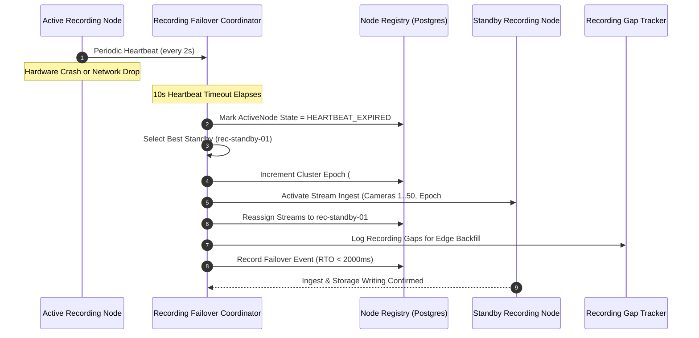

# Recording Engine N+1 Failover (`ha.recording_failover`)

## 1. Overview & Architecture

In large-scale enterprise video surveillance networks (Nx Witness and Milestone XProtect Corporate grade), recording engines continuously ingest RTSP video streams, write segment chunks (MKV/MP4) to storage pools, maintain WAL journals, and index keyframes. 

The **Recording Engine N+1 Failover** architecture provides automated high-availability protection against hardware faults, kernel crashes, network partitions, and node unresponsiveness.

```
       +-----------------------------------------------------------+
       |                  Control Plane & Consensus                |
       |  (PostgreSQL Clustered State + Redis Distributed Leases)  |
       +-----------------------------+-----------------------------+
                                     |
               +---------------------+---------------------+
               | Heartbeat Probes & Liveness Coordinator   |
               +---------------------+---------------------+
                                     |
         +---------------------------+---------------------------+
         |                                                       |
+--------v-------+       +--------v-------+             +--------v-------+
| Active Node 01 |       | Active Node 02 |             | Standby Node   |
| (rec-node-01)  |       | (rec-node-02)  |             | (rec-standby)  |
| Cameras 1..50  |       | Cameras 51..100|             | [HOT RESERVE]  |
+----------------+       +----------------+             +----------------+
        |                        |                               |
        |                        |                               | (Takeover on failure)
+-------v------------------------v-------------------------------v-------+
|                Authoritative Enterprise Storage Pool                   |
|              (NVMe Local Disk / NFS NAS / iSCSI SAN)                   |
+------------------------------------------------------------------------+
```

### Key Principles
1. **N+1 Topology**: A cluster consists of $N$ active recording nodes ingesting streams, plus 1 (or $M$) hot standby nodes connected to storage and ready for instant activation.
2. **Heartbeat & Liveness Probing**: Each recording node periodically reports heartbeat telemetry (CPU, RAM, disk write throughput, active streams, and monotonic epoch).
3. **Heartbeat Timeout Expiration**: If an active node fails to report a heartbeat within `heartbeatTimeoutMs` (default 10,000ms), it is marked `HEARTBEAT_EXPIRED`.
4. **Fencing Tokens (Epochs)**: An atomic epoch increment ensures that if the expired node recovers, any stale writes or commands are rejected, preventing split-brain dual recording.
5. **Instant Ingest Takeover**: The coordinator transfers stream assignments to the least-loaded healthy standby node, spawns RTSP ingest, and preserves recording continuity.
6. **Forensic Recording Gap Logging**: When a takeover occurs, a recording gap record is generated in `recording_gaps` so the automated edge backfill agent can retrieve missing frames from on-camera SD cards.
7. **Graceful Failback**: When the primary node recovers and reports healthy heartbeats, operators or policies can trigger seamless failback with zero dropped streams.

---

## 2. Failover Sequence Flow



---

## 3. Database Schema

Migration `137_recording_engine_n_plus_one_failover.sql` introduces three production tables:

### `recording_nodes`
Tracks all active and standby recording engine instances:
- `id`: Unique identifier (e.g., `rec-node-01`, `rec-node-standby-01`)
- `name`: Human-readable display label
- `host`, `port`: Ingest endpoint coordinates
- `role`: `'ACTIVE'`, `'STANDBY'`, `'DRAINING'`, `'MAINTENANCE'`
- `state`: `'HEALTHY'`, `'DEGRADED'`, `'HEARTBEAT_EXPIRED'`, `'OFFLINE'`, `'FAILOVER_ACTIVE'`
- `current_epoch`: Monotonically increasing fencing token
- `max_stream_capacity`, `active_stream_count`: Ingest limits
- `cpu_percent`, `memory_percent`, `disk_write_mbps`: Real-time telemetry
- `heartbeat_at`: Last observed liveness probe timestamp

### `recording_node_assignments`
Maps camera streams to recording nodes:
- `camera_id`: UUID
- `primary_node_id`: Designated primary recording node
- `current_node_id`: Node actively ingesting the stream (differs during failover)
- `stream_uri`: RTSP/WebRTC ingest URI
- `status`: `'ACTIVE'`, `'FAILED_OVER'`, `'DRAINING'`, `'STOPPED'`
- `takeover_epoch`: Current fencing token
- `failed_over_at`: Timestamp of takeover

### `recording_failover_events`
Audit trail for compliance and SLA tracking:
- `failed_node_id`, `standby_node_id`
- `affected_cameras`, `transferred_cameras`
- `detection_time_ms`, `takeover_time_ms`, `total_rto_ms`
- `reason`: `'HEARTBEAT_EXPIRED'`, `'NODE_CRASH'`, `'MANUAL_FAILOVER'`
- `status`: `'COMPLETED'`, `'RECOVERED'`, `'FAILED'`
- `recovered_at`: Timestamp of failback

---

## 4. REST API Specification

| Method | Path | Description |
| :--- | :--- | :--- |
| `GET` | `/v1/recording/failover/nodes` | List active and standby nodes with real-time heartbeat age |
| `POST` | `/v1/recording/failover/nodes` | Register or update recording node in cluster |
| `POST` | `/v1/recording/failover/nodes/:nodeId/heartbeat` | Ingest periodic node heartbeat telemetry |
| `GET` | `/v1/recording/failover/assignments` | Query camera stream ingest routing |
| `POST` | `/v1/recording/failover/assignments` | Assign camera stream to primary recording node |
| `POST` | `/v1/recording/failover/trigger` | Manually or synthetically trigger node failover |
| `POST` | `/v1/recording/failover/failback` | Execute graceful failback to recovered primary node |
| `POST` | `/v1/recording/failover/check-liveness` | Evaluate cluster liveness and trigger takeovers |
| `GET` | `/v1/recording/failover/events` | Query failover audit history and SLA metrics |
| `GET` | `/v1/recording/failover/metrics` | Retrieve cluster HA KPIs and MTTR |

---

## 5. Production SLA Targets

- **Detection Time**: $\le 10,000\text{ ms}$ (configurable down to $3,000\text{ ms}$ on local LANs)
- **Takeover RTO (Recovery Time Objective)**: $\le 2,000\text{ ms}$
- **RPO (Recovery Point Objective)**: $0\text{ bytes}$ (via Edge SD-card gap backfill)
- **Split-Brain Risk**: $0\%$ (enforced by fencing token epoch increments)
