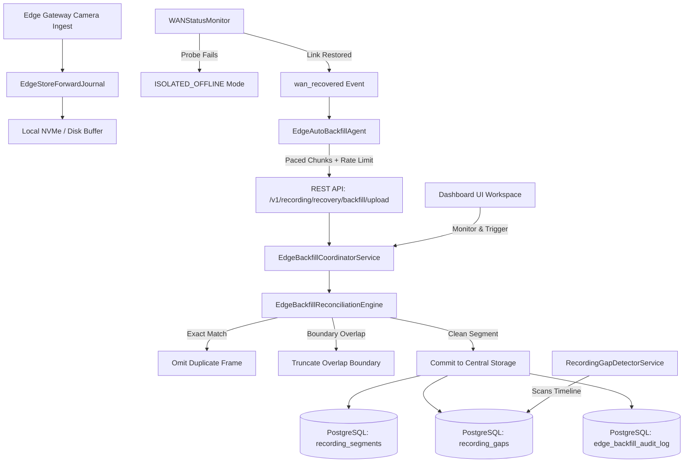

# Recording Gap Recovery & Edge Backfill Architecture

**Capability ID:** `recording.recovery`  
**Maturity:** `PRODUCTION`  
**Owner:** `edge-team`  
**Dependencies:** `control-plane`, `edge-agent`, `recording-engine`, `postgres`

---

## 1. Overview & Operational Problem

In distributed enterprise video surveillance (e.g., bank branch networks, critical retail, and logistics hubs), wide-area network (WAN) connectivity is intermittently severed due to ISP outages, router restarts, fiber cuts, or power fluctuations.

When WAN links drop:
- The edge gateway buffers footage locally in an embedded FIFO store-and-forward journal (`EdgeStoreForwardJournal`).
- The central VMS catalog experiences recording gaps during the disconnection period.
- Once connectivity is restored, unsynchronized edge recordings must be backfilled to central PostgreSQL storage (`recording_segments`).
- **Core Engineering Challenge:** Network interruptions cause stream truncation at the time of failure and premature recording resumption when links flicker. Naive file copying creates duplicate frames, timestamp overlaps, and timeline inflation.

The **Recording Gap Recovery & Edge Backfill Engine** provides:
1. **Automated Gap Detection:** Real-time scanning of catalog intervals with threshold classification (`STREAM_START_GAP`, `NETWORK_DISCONNECTION`, `STREAM_DROPOUT`).
2. **Autonomous Edge Recovery Agent:** Event-driven reconnection listeners (`wan_recovered`) that immediately initiate paced chunk transfers.
3. **Zero-Duplicate Frame Deduplication Algorithm:** Mathematical frame boundary evaluation that detects exact matches (SHA-256 and timestamps) and truncates partial boundary overlaps to eliminate repeated frames.
4. **Bandwidth Throttling:** Rate-limiting pacing to prevent backfill transfers from choking live RTSP/WebRTC viewing.
5. **Tamper-Evident Forensic Audit:** Cryptographic recording of every backfilled chunk into `edge_backfill_audit_log` and automatic resolution of `recording_gaps`.

---

## 2. Component Architecture

---

## 3. Zero-Duplicate Frame Reconciliation Algorithm

When an edge segment $S_{edge} = [t_{start}^{edge}, t_{end}^{edge}]$ is received, the reconciliation engine queries all central segments $S_{central} = [t_{start}^{c}, t_{end}^{c}]$ where $t_{end}^{c} \ge t_{start}^{edge}$ and $t_{start}^{c} \le t_{end}^{edge}$.

### Rule 1: Exact Duplicate Match
If:
$$\text{SHA256}(S_{edge}) = \text{SHA256}(S_{central}) \quad \lor \quad (|t_{start}^{edge} - t_{start}^{c}| < 200\text{ms} \land |t_{end}^{edge} - t_{end}^{c}| < 200\text{ms})$$
$\rightarrow$ **Action:** `EXACT_DUPLICATE`. The segment is acknowledged and marked `SYNCED` in the edge journal, but omitted from re-insertion into central storage.

### Rule 2: Complete Containment
If:
$$t_{start}^{edge} \ge t_{start}^{c} - 100\text{ms} \land t_{end}^{edge} \le t_{end}^{c} + 100\text{ms}$$
$\rightarrow$ **Action:** `EXACT_DUPLICATE`.

### Rule 3: Left-Hand Partial Overlap
If edge recording began before central recording ended (e.g. WAN dropped after edge began capturing):
$$t_{start}^{edge} < t_{end}^{c} \land t_{end}^{edge} > t_{end}^{c} \land (t_{end}^{c} - t_{start}^{edge} > 200\text{ms})$$
$\rightarrow$ **Action:** `OVERLAPPING_RECONCILE`. The start boundary of the edge segment is adjusted:
$$t_{start}^{adjusted} = t_{end}^{c}$$
$$\text{duration}^{adjusted} = t_{end}^{edge} - t_{start}^{adjusted}$$
The adjusted segment is committed with zero duplicated frames.

### Rule 4: Right-Hand Partial Overlap
If edge recording ended after central recording restarted:
$$t_{start}^{edge} < t_{start}^{c} \land t_{end}^{edge} > t_{start}^{c} \land (t_{end}^{edge} - t_{start}^{c} > 200\text{ms})$$
$\rightarrow$ **Action:** `OVERLAPPING_RECONCILE`.
$$t_{end}^{adjusted} = t_{start}^{c}$$

---

## 4. Database Schema (Migration 135)

### `recording_gaps`
| Column | Type | Description |
|---|---|---|
| `id` | UUID | Primary key |
| `camera_id` | VARCHAR(64) | Monitored camera |
| `start_time` | TIMESTAMPTZ | Start of missing footage |
| `end_time` | TIMESTAMPTZ | End of missing footage |
| `gap_duration_seconds`| INTEGER | Duration in seconds |
| `reason` | VARCHAR(64) | NETWORK_DISCONNECTION, etc. |
| `status` | VARCHAR(32) | OPEN, IN_PROGRESS, HEALED, UNRECOVERABLE |
| `healed_at` | TIMESTAMPTZ | Timestamp gap was resolved |
| `backfill_job_id` | UUID | Associated backfill job |
| `segments_recovered_count` | INT | Segments inserted to heal gap |
| `bytes_recovered` | BIGINT | Volume of recovered video data |

### `recording_backfill_jobs`
| Column | Type | Description |
|---|---|---|
| `id` | UUID | Job primary key |
| `branch_id` | VARCHAR(64) | Target edge branch |
| `camera_id` | VARCHAR(64) | Target camera |
| `status` | VARCHAR(32) | PENDING, IN_PROGRESS, COMPLETED, FAILED, CANCELLED |
| `trigger_source` | VARCHAR(32) | AUTO_WAN_RECOVERY, MANUAL_OPERATOR, SCHEDULED_AUDIT |
| `total_segments` | INT | Total segments queued |
| `synced_segments` | INT | Segments committed |
| `skipped_duplicates`| INT | Duplicate segments omitted |
| `reconciled_overlaps`| INT | Overlapping boundaries adjusted |
| `transferred_bytes`| BIGINT | Transferred byte volume |
| `rate_limit_kbps` | INT | Bandwidth throttle limit |

### `edge_backfill_audit_log`
| Column | Type | Description |
|---|---|---|
| `id` | UUID | Primary key |
| `segment_id` | VARCHAR(128) | Edge segment identifier |
| `action` | VARCHAR(32) | SYNCHRONIZED, SKIPPED_DUPLICATE, OVERLAP_RECONCILED |
| `checksum_sha256` | VARCHAR(64) | Cryptographic hash |
| `file_size` | BIGINT | Segment size in bytes |
| `details` | JSONB | Original timestamps and adjustment metadata |

---

## 5. REST API Endpoints

- `GET /v1/recording/recovery/gaps` - List detected gaps with status, camera, and date range filters.
- `POST /v1/recording/recovery/scan-gaps` - Run automated gap detection scan over camera timeline.
- `GET /v1/recording/recovery/jobs` - List backfill jobs with progress and status.
- `GET /v1/recording/recovery/jobs/:jobId` - Fetch detailed job telemetry.
- `POST /v1/recording/recovery/jobs` - Launch manual or scheduled backfill job.
- `POST /v1/recording/recovery/jobs/:jobId/cancel` - Cancel active backfill.
- `POST /v1/recording/recovery/backfill/upload` - Ingest individual edge segment chunk with deduplication.
- `POST /v1/recording/recovery/backfill/sync-batch` - Batch upload edge segments with bandwidth pacing.
- `GET /v1/recording/recovery/stats` - Fleet recovery KPIs and backfilled byte metrics.
- `GET /v1/recording/recovery/audit` - Query cryptographic audit ledger.
