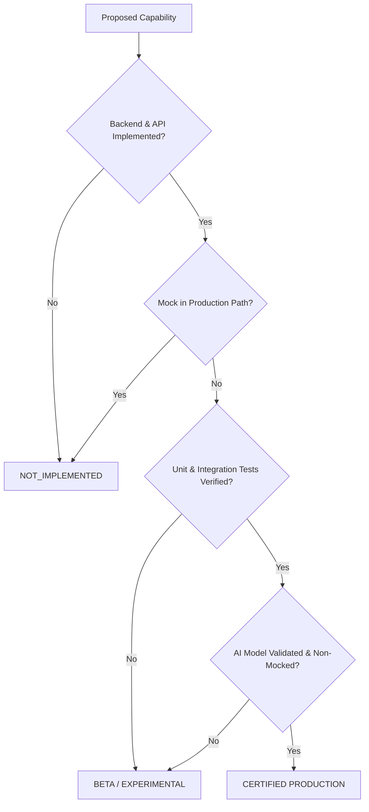

# SENTINEL GRID — Release Capability Certification

## Release Certification Standard

Sentinel Grid enforces strict Release Capability Certification. Features are evaluated against an objective, fail-closed evidence framework before receiving production clearance.

---

## 1. Certification Framework Rules

---

## 2. Deployment Policy Matrix

| Policy Profile | Production Features | Beta Features | Experimental Features | Unimplemented |
| :--- | :---: | :---: | :---: | :---: |
| **Strict Enterprise / Banking** | ✅ Enabled | ❌ Blocked | ❌ Blocked | 🚫 404 Guarded |
| **Standard Enterprise** | ✅ Enabled | ⚠️ Opt-in Banner | ❌ Blocked | 🚫 404 Guarded |
| **Staging & Development** | ✅ Enabled | ✅ Enabled | ⚠️ Guarded | 🚫 404 Guarded |

---

## 3. Production Release Checklist

- [x] All 54 `PRODUCTION` capabilities have verified backend, API routes, and unit tests.
- [x] Zero mock execution branches exist in production paths for `PRODUCTION` features.
- [x] `NOT_IMPLEMENTED` capabilities (`security.tpm_attestation`) are gated behind fail-closed 404/disabled state.
- [x] `verify:capability-truth` static CI audit script passes with 0 errors.
- [x] Full Vitest capability test suite passes with 100% success rate.
- [x] Dashboard UI components implement `PlatformCapabilityGate` to prevent broken UI controls.
