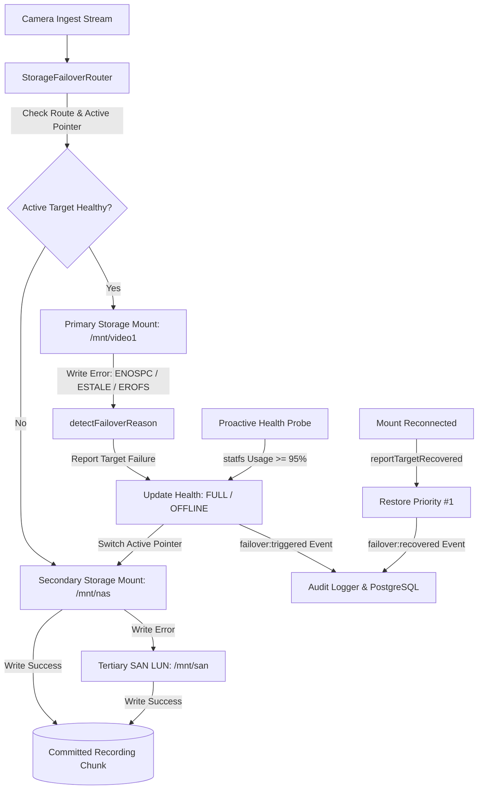

# Production-Ready Automatic Storage Failover Architecture

**Capability ID:** `recording.storage_failover`  
**Maturity:** `PRODUCTION`  
**Owner:** `infrastructure-team`  
**Dependencies:** `recording-engine`, `secondary-mount`, `postgres`

---

## 1. Overview & Problem Statement

In mission-critical video surveillance and compliance recording environments (e.g. banking vaults, secure transport corridors, and data centers), camera streaming writes must never drop video segments due to localized storage impairments.

Storage impairments typically arise from:
1. **Primary Disk Full (`ENOSPC` / Quota Exceeded):** Retention pruning queues or unexpected high-bitrate events exhaust disk space faster than watermarking algorithms can reclaim blocks.
2. **Mount Disconnections / Stale Handles (`ESTALE`, `EPIPE`):** Network-attached storage (NFS/SMB) loses connectivity, resulting in disconnected mount points or stale inode handles.
3. **Hardware & Controller Failures (`EROFS`, `EIO`, `ENODEV`):** Underlying storage arrays remount filesystems as read-only on I/O write failures or SAN multipath drops.

The **Automatic Storage Target Failover** engine ensures **zero-chunk-loss recording** by maintaining a priority-ordered cascade of recording targets (e.g., Primary NVMe -> Secondary NAS -> Tertiary SAN) with automatic, transparent write failover and recovery.

---

## 2. Architecture & Priority Cascade

---

## 3. Storage Impairment Detection Matrix

The router inspects POSIX error codes and filesystem exceptions during writes:

| Error Code / Signal | Classified Reason | Target Health State | Failover Action |
| :--- | :--- | :--- | :--- |
| `ENOSPC`, `EDQUOT`, capacity limit | `DISK_FULL` | `FULL` | Seamless reroute to secondary target |
| `EROFS`, read-only filesystem | `READ_ONLY` | `READ_ONLY` | Seamless reroute to secondary target |
| `ESTALE`, `EPIPE`, stale mount | `MOUNT_DISCONNECTED` | `OFFLINE` | Immediate switchover to tertiary mount |
| `ENOENT`, `EBUSY`, `ENODEV` | `STORAGE_OFFLINE` | `OFFLINE` | Immediate switchover to tertiary mount |
| `ETIMEDOUT`, `ECONNRESET` | `LATENCY_SPIKE` | `DEGRADED` | Seamless reroute if threshold breached |
| Unhandled I/O error | `WRITE_FAILURE` | `DEGRADED` | Switchover with error detail logged |

---

## 4. Proactive Capacity & Mount Health Probing

Rather than waiting for an inline write to fail:
1. `probeTargetHealth(mediaNodeId)` periodically executes `statfs()` on all registered mount paths.
2. If disk usage percentage reaches or exceeds `spilloverThresholdPercent` (default: 95.0%), the router pre-emptively transitions the target to `FULL` and switches the active pointer to the secondary NAS/SAN mount before any recording chunk fails.
3. When the primary mount frees space (e.g. following retention pruning) and disk usage drops below threshold, the probe automatically recovers the target and restores primary priority.

---

## 5. PostgreSQL Schema & Audit Auditing

Implemented in migration `069_automatic_storage_failover.sql`:

### `media_node_storage_targets`
Stores permitted recording targets per media node and camera channel:
- `id` (UUID, Primary Key)
- `tenant_id` (UUID, Foreign Key)
- `media_node_id` (Text)
- `camera_id` (UUID, Optional per-camera override)
- `storage_node_id` (Text)
- `target_name` (Text)
- `target_path` (Text: POSIX mount path or URI)
- `storage_type` (`local-disk`, `nas`, `san`, `s3`, `archive`)
- `storage_tier` (`hot`, `warm`, `cold`, `archive`)
- `priority` (Integer, 1 = Highest)
- `is_active` (Boolean)
- `spillover_threshold_percent` (Numeric, default 95.0%)

### `storage_failover_events`
Immutable audit log recording failover occurrences and resolution timestamps:
- `id` (UUID)
- `tenant_id` (UUID)
- `media_node_id` (Text)
- `from_storage_node_id` (Text)
- `from_target_path` (Text)
- `to_storage_node_id` (Text)
- `to_target_path` (Text)
- `reason` (`storage_failover_reason` enum)
- `error_detail` (Text)
- `occurred_at` (Timestamp with time zone)
- `recovered_at` (Timestamp with time zone - updated upon failback)

---

## 6. REST API Reference

| Method | Endpoint | Description |
| :--- | :--- | :--- |
| `GET` | `/api/v1/storage/failover/targets` | List permitted targets and active target pointer |
| `POST` | `/api/v1/storage/failover/targets` | Configure a new storage target (auto-binds provider) |
| `PATCH` | `/api/v1/storage/failover/targets/:targetId` | Update priority, active status, or spillover threshold |
| `DELETE` | `/api/v1/storage/failover/targets/:targetId` | Unregister / remove a target |
| `POST` | `/api/v1/storage/failover/trigger` | Trigger manual or synthetic failover |
| `POST` | `/api/v1/storage/failover/recover` | Recover target and restore active route if higher priority |
| `POST` | `/api/v1/storage/failover/probe` | Run proactive filesystem probe across targets |
| `GET` | `/api/v1/storage/failover/health` | Get real-time health and capacity breakdown |
| `GET` | `/api/v1/storage/failover/events` | List historical failover audit events |
| `GET` | `/api/v1/storage/failover/metrics` | Retrieve MTTR and telemetry metrics |
