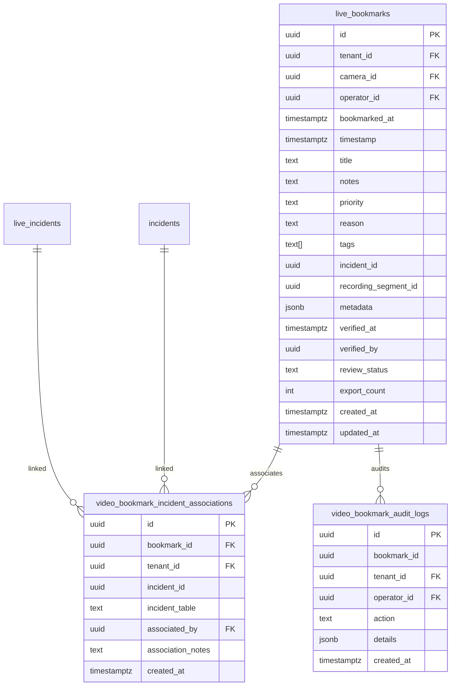

# Video Timeline Bookmarks (`video.bookmarks`)

## 1. Executive Summary & Capability Overview

**Capability Identifier**: `video.bookmarks`  
**Maturity Tier**: `PRODUCTION`  
**Domain**: `VIDEO` / `INVESTIGATION`  
**Owner**: `investigation-team`  

The **Video Timeline Bookmarks** capability empowers security operations center (SOC) operators, branch managers, and forensic investigators to tag precise video stream timestamps with rich operational notes, calibrated priority levels (`LOW`, `MEDIUM`, `HIGH`, `CRITICAL`), category reasons, and multi-incident associations.

### Key Capabilities
- **Operator-Driven Timestamp Marking**: Direct millisecond-accurate tagging on live or recorded video playback scrub bars.
- **Priority Taxonomy & Alert Escalation**: Four-tiered priority classifications (`low`, `medium`, `high`, `critical`) with visual indicator pins on timelines.
- **Bi-Directional Multi-Incident Associations**: Many-to-many linkages between video bookmarks and formal incident dockets (`incidents` and `live_incidents`) with operator justification notes.
- **One-Click Incident Promotion & Legal Hold**: Directly convert a critical bookmark into an enterprise security incident, automatically carving and locking the surrounding video range (`preRollSeconds` + `postRollSeconds`) under immutable evidentiary Legal Hold.
- **Forensic Admissibility & Cryptographic Verification**: Immutable verification timestamps, operator identity attribution, audit logs for all modifications, and SHA-256 sealed export packages.

---

## 2. Architecture & Data Model

### Relational Schema (PostgreSQL)

The persistence layer integrates the core `live_bookmarks` table with junction table `video_bookmark_incident_associations` and forensic ledger `video_bookmark_audit_logs`.

### High-Performance Indexing
- `idx_live_bookmarks_tenant_camera_time`: B-Tree index on `(tenant_id, camera_id, bookmarked_at DESC)` for instantaneous scrub bar retrieval.
- `idx_live_bookmarks_tenant_time`: B-Tree index on `(tenant_id, bookmarked_at DESC)` for chronological audit and search queries.
- `idx_live_bookmarks_priority`: Index on `(tenant_id, priority)` for rapid KPI and emergency filtering.
- `idx_vbm_assoc_incident`: Index on `(tenant_id, incident_id)` for lightning-fast lookups of bookmarks attached to any incident.

---

## 3. REST API Reference

| Method | Route | Description |
|---|---|---|
| `POST` | `/v1/video/bookmarks` | Create a bookmark with notes, priority, tags, and optional incident link |
| `GET` | `/v1/video/bookmarks` | Query bookmarks with filtering (camera, priority, date range, incident, search) |
| `GET` | `/v1/video/bookmarks/:id` | Get single bookmark with joined camera, operator, and incident associations |
| `PATCH` | `/v1/video/bookmarks/:id` | Update title, notes, priority, reason, tags, or review status |
| `DELETE` | `/v1/video/bookmarks/:id` | Soft/hard delete bookmark with forensic audit log entry |
| `POST` | `/v1/video/bookmarks/:id/incidents` | Associate an existing incident with operator notes |
| `DELETE` | `/v1/video/bookmarks/:id/incidents/:incidentId` | Disassociate an incident link |
| `POST` | `/v1/video/bookmarks/:id/create-incident` | Promote bookmark into formal Incident with automated Legal Hold |
| `GET` | `/v1/video/bookmarks/:id/incidents` | List all incidents associated with a bookmark |
| `GET` | `/v1/incidents/:id/bookmarks` | List all bookmarks linked to a specific incident |
| `GET` | `/v1/cameras/:id/timeline-bookmarks` | Lightweight timeline markers formatted for VMS player scrub bar |
| `POST` | `/v1/video/bookmarks/:id/verify` | Sign/verify bookmark for chain of custody admissibility |
| `GET` | `/v1/video/bookmarks/metrics` | Retrieve priority counts, incident link rates, and telemetry |
| `GET` | `/v1/video/bookmarks/export` | Download signed CSV/JSON dossier with SHA-256 seal |

---

## 4. Operator Workflows

### 1. Marking a Bookmark During Playback
1. While monitoring a live camera stream or reviewing synchronized multi-camera playback, click **"Mark Current Time"** or press the bookmark hotkey.
2. Select priority:
   - `CRITICAL`: Immediate emergency (robbery, fire, assault, vault breach).
   - `HIGH`: Suspicious behavior, perimeter breach, cash counter anomaly.
   - `MEDIUM`: Safety hazard, customer dispute, unauthorized entry.
   - `LOW`: Routine handover observation, audit marker.
3. Add descriptive notes and relevant classification tags (e.g. `cash-handling`, `counter-3`, `unattended-bag`).
4. Save bookmark; visual pin immediately renders on the scrub bar.

### 2. Incident Correlation & Direct Promotion
- If the bookmark corresponds to an existing incident ticket, use **"Link Incident"** to attach it.
- If no ticket exists yet, click **"Promote"**:
  - Automatically provisions a new live incident docket.
  - Carves pre-roll (120s) and post-roll (180s) buffers.
  - Establishes an immutable **Recording Legal Hold** preventing storage expiration or automated deletion.
